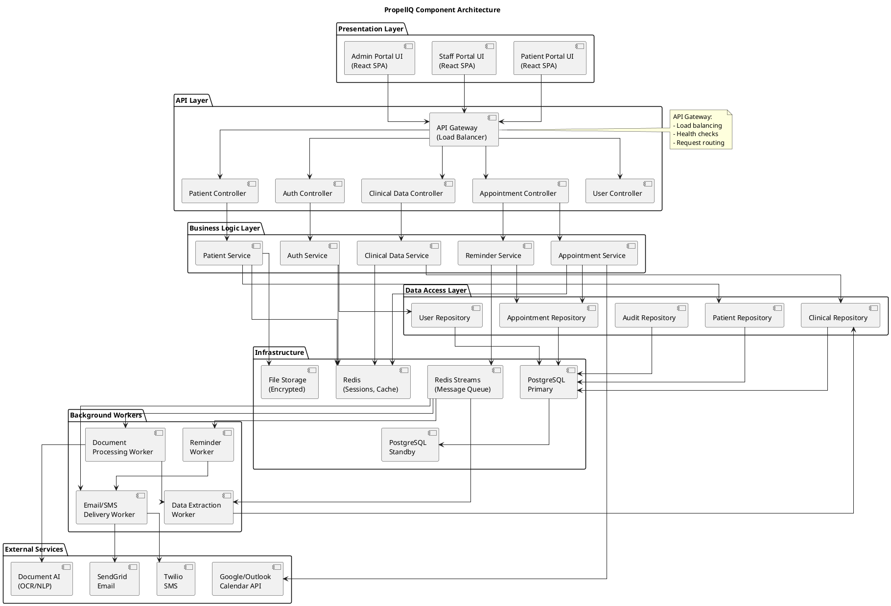
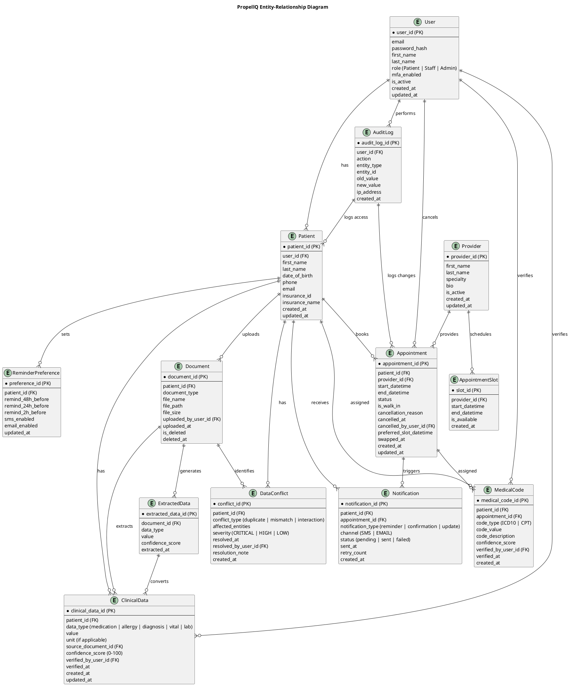
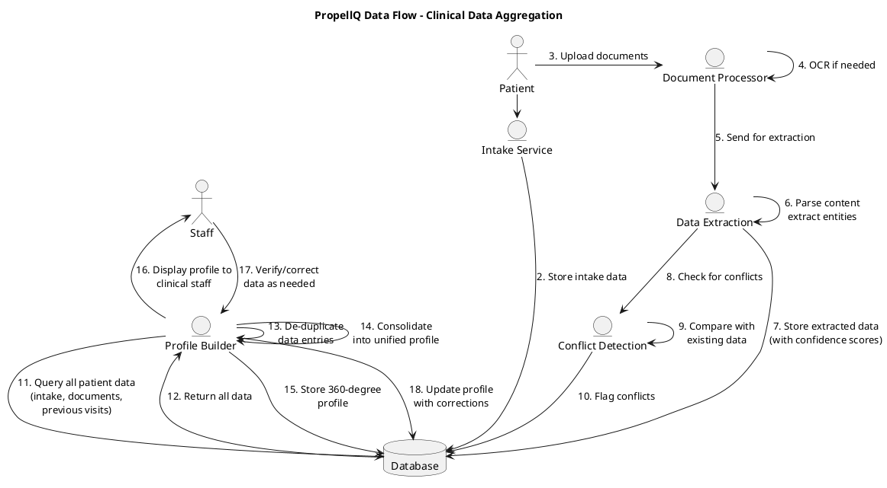
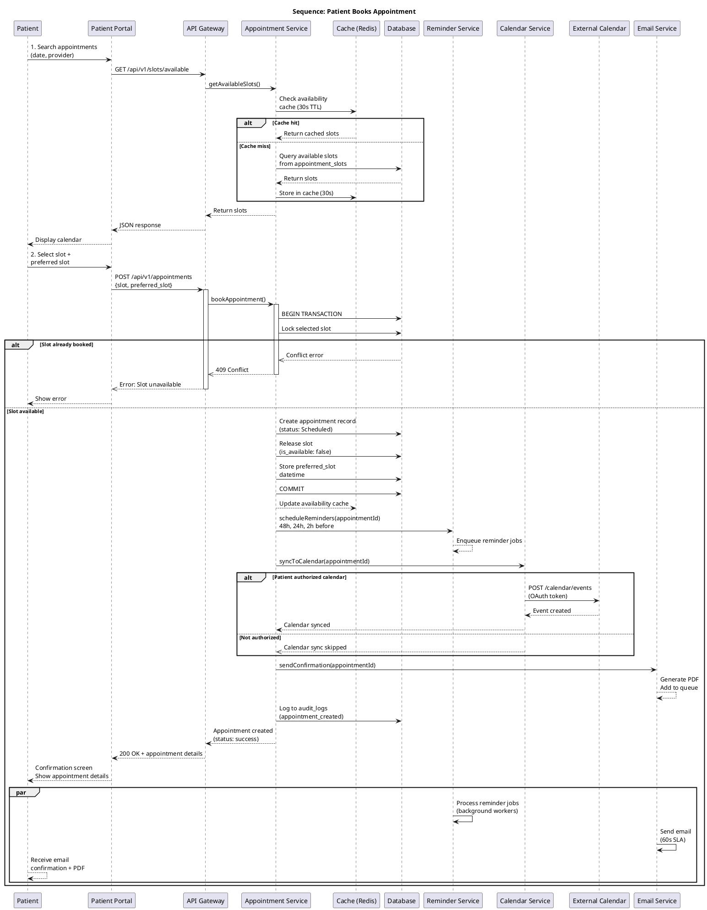
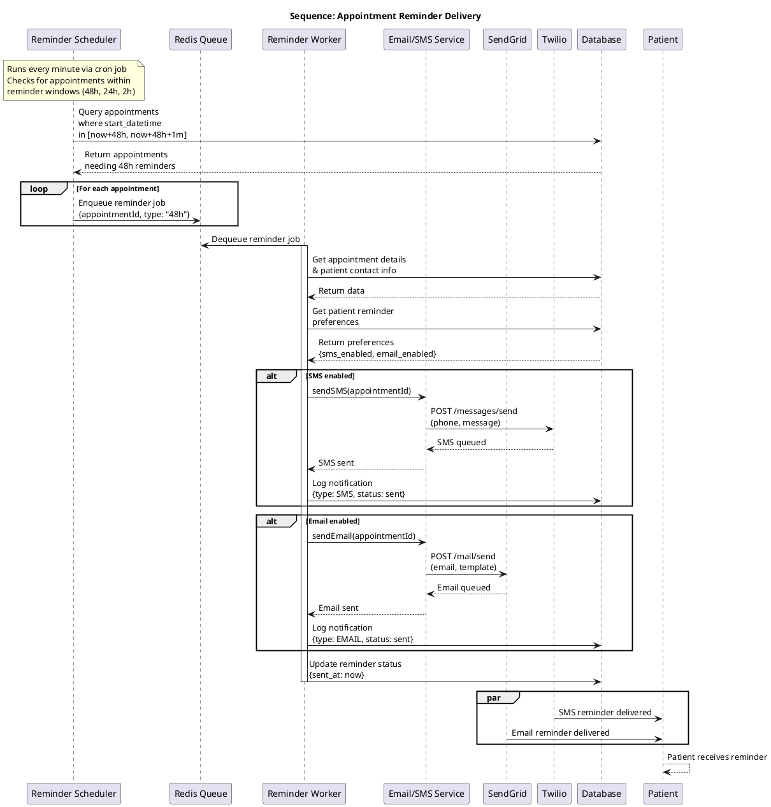
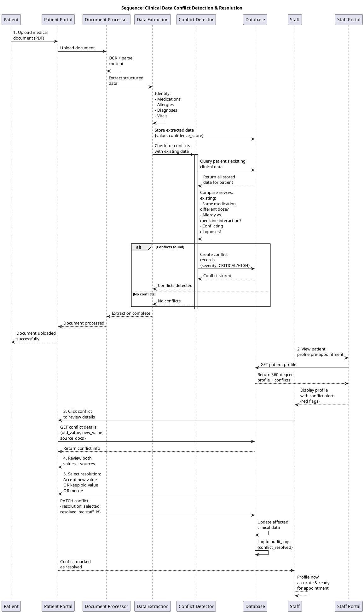
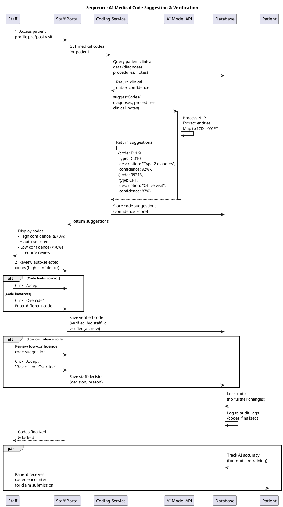
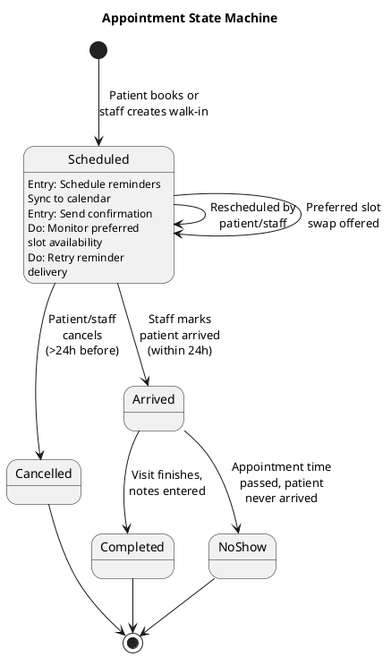
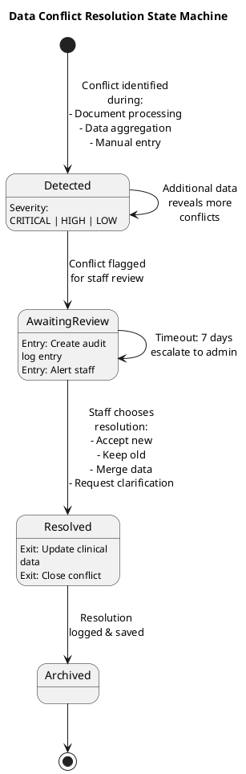
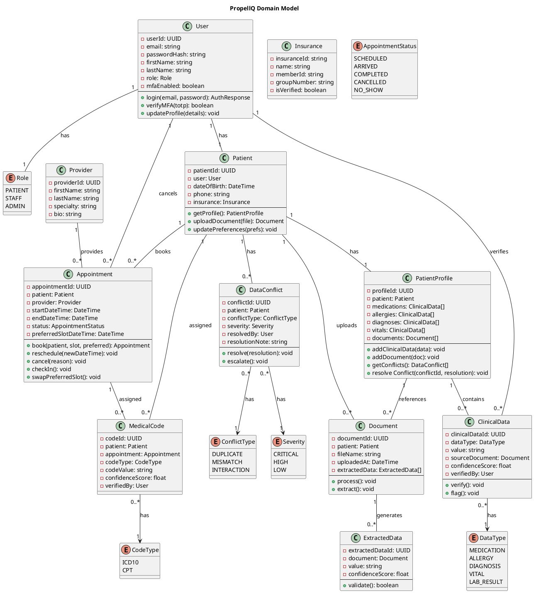

# UML Architectural Models: Unified Patient Access & Clinical Intelligence Platform

**Document Version:** 1.0  
**Date:** 2026-06-17  
**Status:** Draft  
**Source:** spec.md, design.md

---

## Table of Contents
1. [System Context Diagram](#system-context-diagram)
2. [Component Architecture Diagram](#component-architecture-diagram)
3. [Entity-Relationship Diagram (ERD)](#entity-relationship-diagram)
4. [Data Flow Diagrams](#data-flow-diagrams)
5. [Sequence Diagrams](#sequence-diagrams)
6. [Deployment Topology Diagram](#deployment-topology-diagram)
7. [State Diagrams](#state-diagrams)

---

## System Context Diagram

### Overview
The system context diagram shows PropellQ as a single system and its interactions with external actors and systems. This high-level view establishes system boundaries and key integrations.

```puml
@startuml system-context
!define DIRECTION top to bottom
skinparam linetype ortho
title PropellQ System Context Diagram

actor Patient as P
actor "Staff\n(Front Desk/Clinical)" as S
actor Admin as A
system PropellQ as PQ
database "Google Calendar\nOutlook Calendar" as CALENDAR
system "Twilio\n(SMS Provider)" as TWILIO
system "SendGrid\n(Email Provider)" as SENDGRID
database "PostgreSQL\nDatabase" as DB
system "Document AI\n(OCR, NLP)" as AI
system "ICD-10/CPT\nCoding Engine" as CODING

P --> PQ: Book appointments\nUpload documents\nManage profile\nReceive reminders
S --> PQ: Create walk-ins\nManage queue\nCheck-in patients\nReview clinical data
A --> PQ: Manage users\nConfigure settings\nView analytics

PQ --> CALENDAR: Sync appointments\n(OAuth 2.0)
PQ --> TWILIO: Send SMS reminders\n(API)
PQ --> SENDGRID: Send email confirmations\nand reminders (API)
PQ --> DB: Persist data\n(ACID transactions)
PQ --> AI: Process documents\nExtract data\n(async jobs)
PQ --> CODING: Suggest ICD-10/CPT codes\n(ML model)

note right of PQ
  Core System:
  - Appointment booking & reminders
  - Clinical data aggregation
  - Medical code suggestion
  - HIPAA-compliant data handling
  - 99.9% uptime SLA
end note

@enduml
```

---

## Component Architecture Diagram

### Overview
The component architecture diagram breaks down PropellQ into major components and shows their dependencies and interactions.



---

## Entity-Relationship Diagram

### Overview
The ERD shows all data entities, their attributes, and relationships in the PropellQ system.



---

## Data Flow Diagrams

### DFD Level 0: System Boundary

```puml
@startuml dfd-level0
title PropellQ Data Flow Diagram - Level 0 (System Boundary)

actor Patient
actor Staff
actor Admin
system PropellQ as PQ
database Database as DB
system "External APIs" as EXT

Patient -d-> PQ: 1. Book appointment,\nUpload documents
Staff -d-> PQ: 2. Check-in, manage\nqueue, review data
Admin -d-> PQ: 3. Manage users,\nview analytics
PQ -d-> DB: 4. Store/retrieve\ndata
PQ -r-> EXT: 5. Send reminders\n(SMS/Email),\nSync calendars
@enduml
```

### DFD Level 1: Major Processes

```puml
@startuml dfd-level1
title PropellQ Data Flow Diagram - Level 1 (Major Processes)

actor Patient
actor Staff
actor Admin
database Database as DB
system "Twilio/SendGrid" as Notifications
system "Calendar APIs" as CalendarAPI

Patient -d-> [1.0\nBooking Process]
[1.0\nBooking Process] -d-> DB: Save appointment
[1.0\nBooking Process] --> [2.0\nReminder Process]: Trigger reminders
[1.0\nBooking Process] --> [3.0\nCalendar Sync]: Sync to calendar

[2.0\nReminder Process] -r-> Notifications: Send SMS/Email\nreminders
Patient <-l- Notifications: Receive notifications

Staff -d-> [4.0\nQueue Management]
[4.0\nQueue Management] -d-> DB: Update appointment\nstatus
[4.0\nQueue Management] --> [5.0\nClinical Data]

Admin -d-> [6.0\nUser Management]
[6.0\nUser Management] -d-> DB: Manage users

[5.0\nClinical Data] -d-> DB: Store clinical data
[5.0\nClinical Data] --> [7.0\nMedical Coding]: Suggest codes
[7.0\nMedical Coding] -d-> DB: Save codes

[3.0\nCalendar Sync] -r-> CalendarAPI: Create/update\ncalendar event
@enduml
```

### DFD: Appointment Booking Flow

```puml
@startuml dfd-booking
title PropellQ Data Flow - Appointment Booking Details

actor Patient
database Cache as CACHE
entity "Slot Mgmt" as Slots
entity "Appointment Mgmt" as Appt
entity "Reminder Scheduler" as Reminder
database Database as DB
entity "Calendar Sync" as Calendar
system "External Calendar" as ExtCalendar
entity "Notification Service" as NotifSvc
system "SendGrid" as EmailSvc

Patient -r-> Slots: 1. Request available\nslots (date, provider)
Slots -d-> Cache: 2. Check cache for\navailability
Cache -d-> DB: 3. Query if not\nin cache
DB -d-> Cache: 4. Return available\nslots
Cache -u-> Slots: 5. Return slots to\npatient
Slots -u-> Patient: 6. Display available\nslots

Patient -d-> Appt: 7. Select slot & book\n(primary + preferred)
Appt -r-> DB: 8. Create appointment\n(atomic transaction)
DB -u-> Appt: 9. Appointment created

Appt -d-> Reminder: 10. Schedule reminders\n(48h, 24h, 2h)
Reminder -d-> DB: 11. Store reminder\nschedule

Appt --> Calendar: 12. Prepare calendar event
Calendar --> ExtCalendar: 13. Sync to external\ncalendar (if auth)
ExtCalendar -u-> Calendar: 14. Calendar synced

Appt --> NotifSvc: 15. Trigger confirmation
NotifSvc --> EmailSvc: 16. Send email\nconfirmation (PDF)
EmailSvc -u-> Patient: 17. Confirmation email\nreceived

Appt -d-> DB: 18. Log to audit trail
@enduml
```

### DFD: Clinical Data Aggregation Flow



---

## Sequence Diagrams

### Sequence: Patient Books Appointment



### Sequence: Appointment Reminder Flow



### Sequence: Clinical Data Conflict Resolution



### Sequence: Medical Code Suggestion



---

## Deployment Topology Diagram

### Overview
The deployment diagram shows how PropellQ components are deployed across physical infrastructure.

```puml
@startuml deployment
title PropellQ Deployment Topology

node "Client Devices" as ClientNode {
    component PatientApp [Patient Portal\n(React SPA)]
    component StaffApp [Staff Portal\n(React SPA)]
    component AdminApp [Admin Portal\n(React SPA)]
}

cloud "CDN / Free Hosting" as CDN {
    artifact NetlifyStatic [Static Assets\n(CSS, JS, Images)\nNetlify/Vercel]
}

node "Internet" as Internet {
}

node "Windows Server (On-Premise)" as ServerNode {
    node "Load Balancer\n(IIS URL Rewrite)" as LB {
        component LBComponent [Request Routing\nSSL Termination\nHealth Checks]
    }
    
    node "API Instance 1\n(IIS + ASP.NET Core)" as API1 {
        component API1App [AppointmentController\nPatientController\nClinicalDataController]
    }
    
    node "API Instance 2\n(IIS + ASP.NET Core)" as API2 {
        component API2App [AppointmentController\nPatientController\nClinicalDataController]
    }
    
    node "API Instance 3\n(IIS + ASP.NET Core)" as API3 {
        component API3App [AppointmentController\nPatientController\nClinicalDataController]
    }
    
    node "Database Tier" as DBTier {
        database PgPrimary [PostgreSQL Primary\n(Read/Write)]
        database PgStandby [PostgreSQL Standby\n(Replication)]
    }
    
    node "Cache Tier" as CacheTier {
        database RedisPrimary [Redis Primary\n(Sessions, Cache)]
        database RedisStandby [Redis Standby\n(Replication)]
    }
    
    node "Storage" as Storage {
        artifact FileStore [File Storage\n(Patient Documents)\nEncrypted]
        artifact Backups [Backup Storage\n(Daily Snapshots)\n7-year retention]
    }
    
    node "Background Workers" as Workers {
        component ReminderWorker [Reminder Delivery\nWorker]
        component DocumentWorker [Document Processing\nWorker]
        component ExtractionWorker [Data Extraction\nWorker]
    }
}

node "External Services" as External {
    artifact GoogleCalendar [Google Calendar\n(OAuth 2.0)]
    artifact OutlookCalendar [Outlook Calendar\n(OAuth 2.0)]
    artifact Twilio [Twilio\n(SMS API)]
    artifact SendGrid [SendGrid\n(Email API)]
}

' Connections
PatientApp -.-> CDN: Load static assets
StaffApp -.-> CDN: Load static assets
AdminApp -.-> CDN: Load static assets

CDN -.-> Internet: Serve via CDN
Internet -down-> LB: HTTPS requests

LB --> API1: Route requests
LB --> API2: Route requests
LB --> API3: Route requests

API1 --> PgPrimary: Query/Update
API2 --> PgPrimary: Query/Update
API3 --> PgPrimary: Query/Update

API1 --> RedisPrimary: Get/Set cache\nDequeue jobs
API2 --> RedisPrimary: Get/Set cache\nDequeue jobs
API3 --> RedisPrimary: Get/Set cache\nDequeue jobs

PgPrimary --> PgStandby: Replication stream

ReminderWorker --> RedisPrimary: Dequeue jobs
DocumentWorker --> RedisPrimary: Dequeue jobs
ExtractionWorker --> RedisPrimary: Dequeue jobs

ReminderWorker --> PgPrimary: Log delivery status
DocumentWorker --> PgPrimary: Store extracted data
ExtractionWorker --> PgPrimary: Update clinical data

API1 --> FileStore: Upload/Download\ndocuments
API2 --> FileStore: Upload/Download\ndocuments
API3 --> FileStore: Upload/Download\ndocuments

FileStore --> Backups: Daily backup

ReminderWorker --> Twilio: Send SMS
ReminderWorker --> SendGrid: Send Email

API1 --> GoogleCalendar: Sync appointments
API1 --> OutlookCalendar: Sync appointments

note bottom of ServerNode
  Windows Server Infrastructure:
  - All components self-hosted
  - No managed cloud services
  - N+1 redundancy for API instances
  - Database replication & failover
  - Redis persistence for recovery
  - 99.9% uptime target
end note

@enduml
```

---

## State Diagrams

### Appointment State Machine



### Patient Data Conflict State Machine



---

## Class Diagram (Domain Model)

### Core Domain Classes



---

## Component Interaction Matrix

### Service Dependencies & Call Matrix

| Service | Calls | Called By | Async | Data |
|---------|-------|-----------|-------|------|
| AppointmentService | PatientService, ReminderService, ClinicalDataService | Controllers, RemindService | No | Appointments, Slots |
| PatientService | DocumentService, ClinicalDataService, CalendarService | Controllers | No | Patients, Documents |
| ClinicalDataService | PatientService | Controllers, ExtractionWorker | No | ClinicalData, MedicalCodes |
| ReminderService | AppointmentService, NotificationService | AppointmentService | Yes | Reminders, Notifications |
| AuthService | UserRepository | Controllers | No | Users, Tokens |
| DocumentService | ExtractionService, ConflictService | PatientService | Yes | Documents |
| ExtractionService | DocumentService, ClinicalDataService, ConflictService | DocumentService (async) | Yes | ExtractedData |
| ConflictService | ClinicalDataService | ExtractionService | No | Conflicts |
| CalendarService | PatientService | PatientService | Yes | Calendar Events |
| NotificationService | ReminderService | ReminderService | Yes | Notifications |

---

## Version History

| Version | Date | Author | Changes |
|---------|------|--------|---------|
| 1.0 | 2026-06-17 | AI Assistant | Initial UML models and diagrams |

---

**Document Status:** Ready for Review  
**Next Steps:** Figma Specification (UI Screens), Create Epics (Implementation Breakdown)

---

## Diagram Reference Guide

All diagrams in this document use PlantUML syntax and can be rendered into PNG/SVG using:
- PlantUML online editor: https://www.plantuml.com/plantuml/uml/
- Local PlantUML: `plantuml models.md -o models_output/`
- VS Code extensions: PlantUML Preview

### Color Coding
- **Blue:** System/Process/Database
- **Green:** Actor/User
- **Yellow:** Data/Entity
- **Red:** Error/Conflict/Critical

