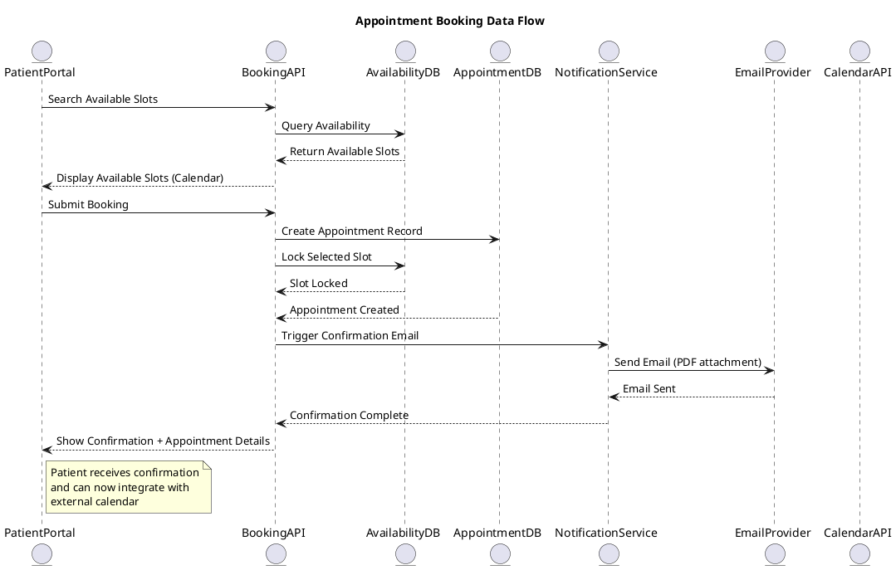
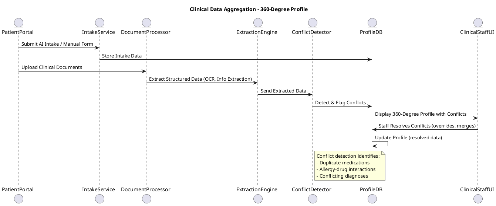
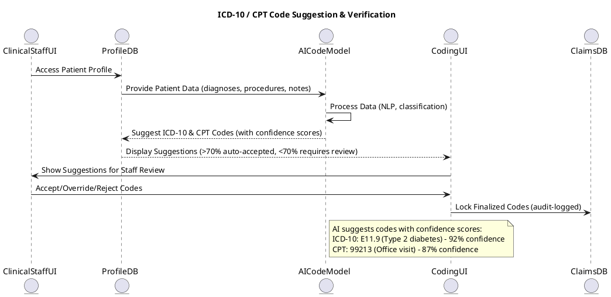

# Functional Specification: Unified Patient Access & Clinical Intelligence Platform

**Document Version:** 1.0  
**Date:** 2026-06-17  
**Status:** Draft  
**Source:** BRD_Appointment_Booking_Clinical_Intelligence_Platform.md

---

## Executive Summary

This specification details the functional requirements and use cases for the Unified Patient Access & Clinical Intelligence Platform (PropellQ Appointment Booking System). The platform integrates patient scheduling, clinical data management, and intelligent coding to reduce no-show rates, streamline clinical prep, and provide a seamless end-to-end healthcare experience.

**Key Success Metrics:**
- Reduce no-show rate by 15%+
- Reduce clinical data extraction time from 20 minutes to 2 minutes
- Achieve >98% AI-Human Agreement Rate for clinical coding
- 99.9% platform uptime

---

## Table of Contents
1. [Functional Requirements](#functional-requirements)
2. [Use Cases](#use-cases)
3. [Acceptance Criteria](#acceptance-criteria)
4. [Use Case Diagrams](#use-case-diagrams)
5. [Data Flow Diagrams](#data-flow-diagrams)
6. [Traceability Matrix](#traceability-matrix)
7. [Out-of-Scope Items](#out-of-scope-items)

---

## Functional Requirements

### Category: Patient Appointment Booking

#### FR-001: Patient Self-Service Appointment Booking
**Priority:** CRITICAL  
**Business Value:** High - Enables primary patient interaction  
**Complexity:** High

**Description:**
Patients must be able to search available appointment slots, view provider information, and book appointments through an intuitive, mobile-responsive interface. The system shall display available slots based on provider schedules and real-time capacity.

**Acceptance Criteria:**
- Patients can filter appointments by date, time, provider, and clinical specialty
- System displays real-time availability with visual calendar interface
- Booking confirmation is instant and provides appointment details
- Appointment confirmation is sent via email as PDF within 60 seconds
- System prevents double-booking by locking selected slots during checkout

**Linked Use Cases:** UC-001, UC-002

---

#### FR-002: Dynamic Preferred Slot Swap
**Priority:** CRITICAL  
**Business Value:** High - Differentiator; reduces no-show rate  
**Complexity:** Very High

**Description:**
When a patient books an available slot, they may simultaneously select a preferred but currently unavailable slot. If the preferred slot becomes available within a configurable time window (e.g., 24 hours), the system shall automatically:
1. Notify the patient of the availability
2. Automatically swap the appointment to the preferred slot
3. Release and re-offer the original slot to waitlist/queue
4. Send updated confirmation via email

**Acceptance Criteria:**
- Patient selects primary booking slot + preferred slot during checkout
- System monitors preferred slot availability for 24 hours (configurable)
- Automatic swap occurs without manual intervention
- Patient receives swap notification via SMS + email within 5 minutes
- Original slot is available for re-booking within 2 minutes of swap
- Audit log tracks all swap events for compliance

**Linked Use Cases:** UC-001, UC-003

---

#### FR-003: Multi-Channel Appointment Reminders
**Priority:** CRITICAL  
**Business Value:** High - Primary lever for reducing no-show rate  
**Complexity:** Medium

**Description:**
System shall deliver automated, multi-channel appointment reminders at configurable intervals (e.g., 48 hours, 24 hours, 2 hours before appointment) via SMS and email. Reminders shall be personalized with patient name, appointment details, and provider information.

**Acceptance Criteria:**
- Reminders sent via SMS and email at predefined intervals
- SMS delivery success rate ≥95%
- Email delivery success rate ≥99%
- Patient can customize reminder preferences (SMS only, email only, both)
- Reminders are time-zone aware
- Failed delivery attempts retry up to 3 times within 1 hour
- Audit log tracks all reminder events

**Linked Use Cases:** UC-002, UC-004

---

#### FR-004: Calendar Integration (Google/Outlook)
**Priority:** HIGH  
**Business Value:** Medium - Improves patient workflow integration  
**Complexity:** Medium

**Description:**
After booking, patients may authorize the platform to add appointments to their Google Calendar or Outlook calendar. The system shall sync bidirectionally, allowing cancellations or reschedules from either platform to update the other.

**Acceptance Criteria:**
- OAuth 2.0 integration with Google Calendar and Microsoft Graph (Outlook)
- Patients authorize calendar access via secure consent flow
- Appointment syncs to patient's calendar within 30 seconds
- Calendar event includes provider name, location, confirmation number, and dial-in details (if telehealth)
- Changes made in external calendar are reflected in PropellQ within 5 minutes
- Patient can revoke calendar access at any time

**Linked Use Cases:** UC-001, UC-005

---

### Category: Patient Intake & Digital Forms

#### FR-005: Flexible Patient Intake (AI-Assisted & Manual Fallback)
**Priority:** HIGH  
**Business Value:** High - Streamlines data collection and differentiates platform  
**Complexity:** Very High

**Description:**
Patients must choose between two intake pathways before appointment:
1. **AI-Assisted Conversational Intake:** Natural language chatbot collects medical history, current medications, allergies, and reason for visit
2. **Traditional Manual Form:** Structured form with pre-populated fields from previous visits

The system shall support seamless switching between pathways and allow edits without forcing human assistance.

**Acceptance Criteria:**
- Patients select intake method during booking or pre-visit portal
- AI chatbot gathers: Chief complaint, medical history, medication list, allergies, insurance verification
- Manual form supports auto-population from previous visits (with consent)
- Patient can switch between AI and manual modes at any time
- System stores both natural language responses and structured data
- Patient edits are captured without validation errors or forced interactions
- AI responses are 95%+ consistent with manual form requirements
- Intake completion rate ≥85% before appointment

**Linked Use Cases:** UC-006, UC-007

---

#### FR-006: Insurance Pre-Check (Soft Validation)
**Priority:** HIGH  
**Business Value:** Medium - Reduces claim denials; improves billing efficiency  
**Complexity:** Medium

**Description:**
During intake, system shall perform soft validation of insurance information by comparing patient-provided insurance name and ID against an internal predefined database of dummy/test records. This is NOT a hard validation but a soft check to identify potential issues.

**Acceptance Criteria:**
- Patient provides insurance name, ID, group number, and member ID
- System compares against internal predefined insurance database
- If no match, system flags as "unverified" but allows booking to proceed
- Patient receives warning notification if insurance data appears incomplete
- Unverified insurance is marked for manual staff review post-appointment
- Staff dashboard displays pending insurance verifications
- Audit log tracks all insurance checks for compliance

**Linked Use Cases:** UC-006, UC-008

---

### Category: Clinical Data Management & Coding

#### FR-007: 360-Degree Patient Profile Construction
**Priority:** CRITICAL  
**Business Value:** Very High - Core differentiator; enables clinical intelligence  
**Complexity:** Very High

**Description:**
The system shall build a unified, de-duplicated patient profile by ingesting and aggregating:
1. Pre-visit patient intake data (from FR-005)
2. Patient-uploaded historical medical documents (PDF reports, test results, imaging reports, prior visit notes)
3. Post-visit clinical notes and encounter records

The profile shall include structured extraction of patient vitals, medications, allergies, diagnoses, and relevant clinical history, presenting data with clear traceability to source documents.

**Acceptance Criteria:**
- System ingests up to 100 documents per patient (configurable limit)
- Supports PDF, DOCX document formats for upload
- Document processing occurs within 60 seconds of upload
- Extracted data is tagged with source document, date, and confidence score
- System identifies and flags duplicate/conflicting data (e.g., conflicting medications)
- Patient profile displays consolidated medication list with flagged conflicts
- All extracted data is human-verifiable with links to source documents
- Patient can upload and update documents anytime via patient portal
- System maintains immutable audit trail of all profile changes

**Linked Use Cases:** UC-009, UC-010, UC-011

---

#### FR-008: ICD-10 & CPT Code Extraction & Mapping
**Priority:** CRITICAL  
**Business Value:** Very High - Primary value lever for clinical team  
**Complexity:** Very High

**Description:**
Based on aggregated patient data (diagnoses, procedures, clinical notes), the system shall automatically extract and map relevant ICD-10 (diagnosis) and CPT (procedure) codes. The AI model shall suggest codes with confidence scores, requiring human verification before finalization.

**Acceptance Criteria:**
- AI suggests ICD-10 codes based on patient diagnoses and chief complaints
- AI suggests CPT codes based on procedures documented in clinical notes
- Each suggestion includes confidence score (0-100%)
- Only suggestions with confidence ≥70% are automatically accepted; others require staff review
- Staff can accept, reject, or override suggestions through verification UI
- System tracks acceptance rate and maintains historical accuracy metrics
- AI-Human Agreement Rate ≥98% (tracked as success metric)
- Rejected suggestions are logged for model retraining
- Final codes are locked and audit-logged before claim submission

**Linked Use Cases:** UC-012, UC-013

---

#### FR-009: Critical Data Conflict Detection & Alerting
**Priority:** CRITICAL  
**Business Value:** Very High - Prevents safety incidents and claim denials  
**Complexity:** High

**Description:**
The system shall detect, surface, and alert clinical staff to critical conflicts in patient data, such as:
- Duplicate/conflicting medications (same drug, different doses)
- Allergy-medication interactions
- Duplicate diagnoses with conflicting details
- Conflicting vital signs between recent visits

Conflicts shall be prominently displayed with severity levels (CRITICAL, HIGH, LOW) and require staff acknowledgment.

**Acceptance Criteria:**
- System flags conflicting medications with side-by-side comparison
- Allergy-drug interaction checks run automatically (integration with drug database)
- Conflicts tagged with date ranges and source documents
- CRITICAL conflicts block appointment confirmation and require override reason
- Staff receives real-time alert dashboard for unresolved conflicts
- Conflict acknowledgment is audit-logged
- System tracks "Critical Conflicts Identified" as success metric

**Linked Use Cases:** UC-011, UC-014

---

### Category: Appointment Management (Staff)

#### FR-010: Staff Walk-In Appointment Booking
**Priority:** HIGH  
**Business Value:** Medium - Supports same-day operations  
**Complexity:** Medium

**Description:**
Only staff members (front desk, call center) may create walk-in appointments. Patients cannot self-create walk-in appointments. Staff shall be able to search for existing patients or create new patient records, then assign available walk-in slots.

**Acceptance Criteria:**
- Staff access walk-in booking portal with role-based permissions
- Staff searches for patients by name, DOB, insurance ID, or phone
- Staff can create new patient records if not found (with required fields)
- Staff assigns available walk-in slots from queue
- System optionally creates a patient account post-booking (staff choice)
- Walk-in appointments are flagged as such in records
- Audit log tracks all walk-in creations with staff ID and timestamp
- Patient receives confirmation email/SMS even for staff-created walk-ins

**Linked Use Cases:** UC-015, UC-016

---

#### FR-011: Same-Day Queue Management
**Priority:** HIGH  
**Business Value:** Medium - Improves clinical operations  
**Complexity:** Medium

**Description:**
Staff shall manage same-day appointment queue with real-time visibility of all patients scheduled and checked-in for the day. System shall allow reordering, marking as "Arrived", and tracking wait times.

**Acceptance Criteria:**
- Queue displays all appointments and walk-ins for current day
- Staff can reorder queue based on clinical priority or availability
- Staff marks patients as "Arrived" when checking in
- System tracks wait time from scheduled to actual start
- Average wait time is displayed as operational metric
- Queue state is persisted and accessible to clinical staff
- Historical queue metrics are tracked for capacity planning

**Linked Use Cases:** UC-016, UC-017

---

#### FR-012: Patient Check-In Management (Staff-Only)
**Priority:** HIGH  
**Business Value:** Medium - Central to staff workflow  
**Complexity:** Low

**Description:**
Only staff members may mark patients as "Arrived". Patients cannot self-check in via QR codes, mobile apps, or web portals. Check-in updates appointment status and triggers any relevant workflows (e.g., vitals collection).

**Acceptance Criteria:**
- Staff marks patients as "Arrived" via staff portal
- Check-in timestamp is recorded
- Patient status updates in real-time queue display
- Clinical staff is notified when patient is checked in
- Pre-appointment workflows (e.g., vitals, consent) are triggered
- Check-in is audit-logged with staff ID

**Linked Use Cases:** UC-016, UC-017

---

### Category: Waitlist & Cancellation Management

#### FR-013: Appointment Waitlist Functionality
**Priority:** HIGH  
**Business Value:** Medium - Improves appointment fill rate  
**Complexity:** Medium

**Description:**
When all slots for a provider/time are full, patients may join a waitlist. If a slot becomes available (cancellation, rescheduling, or preferred slot swap), the system automatically offers the slot to the first eligible waitlisted patient.

**Acceptance Criteria:**
- Patients can join waitlist if no slots available
- Waitlist is ordered by join date and patient priority (configurable)
- When a slot opens, top waitlisted patient is automatically offered
- Patient has 30 minutes to accept or decline offer
- Offer includes automatic calendar updates if accepted
- Declined offers move to next waitlisted patient
- Audit log tracks all waitlist events

**Linked Use Cases:** UC-003, UC-018

---

#### FR-014: Appointment Cancellation & Rescheduling
**Priority:** HIGH  
**Business Value:** Medium - Standard booking operation  
**Complexity:** Low

**Description:**
Patients and staff shall be able to cancel or reschedule appointments up to a configurable time before appointment (e.g., 24 hours). Cancellations trigger waitlist processing and calendar sync updates.

**Acceptance Criteria:**
- Patients cancel/reschedule via patient portal with reason (optional)
- Staff cancel/reschedule via staff portal with reason (required)
- Cancellations before 24 hours are free; late cancellations are flagged for review
- Cancellation triggers waitlist processing for that slot
- Rescheduling maintains patient's preferred slot preference (if applicable)
- Calendar updates are synced (if patient authorized calendar integration)
- Cancellation/reschedule is audit-logged

**Linked Use Cases:** UC-003, UC-019

---

### Category: User & Role Management

#### FR-015: Role-Based Access Control (RBAC)
**Priority:** CRITICAL  
**Business Value:** High - Foundation for multi-user system  
**Complexity:** Medium

**Description:**
System shall enforce strict role-based access control with three primary roles:
1. **Patient:** Can view/book appointments, manage intake, view own profile, authorize integrations
2. **Staff (Front Desk/Call Center):** Can create walk-in appointments, manage queue, check-in patients, view appointment schedules
3. **Admin:** Can manage users (staff & admin), configure system settings, view analytics, manage clinic information

**Acceptance Criteria:**
- Each user has exactly one primary role (no multi-role assignments)
- Role assignments are managed by admins only
- Each role has least-privilege access to features and data
- Staff cannot access patient data outside their assigned providers/clinics
- Audit log captures all role assignments and permission changes
- Session tokens include role information
- Permission checks occur on every API call

**Linked Use Cases:** UC-020, UC-021

---

#### FR-016: User Account Management (Admin)
**Priority:** HIGH  
**Business Value:** Medium - Operational requirement  
**Complexity:** Low

**Description:**
Admins shall manage user accounts for staff and other admins, including creation, role assignment, activation/deactivation, and password resets.

**Acceptance Criteria:**
- Admins create staff accounts with role assignment
- Staff accounts can be activated/deactivated (soft delete)
- Password resets are secure (email-based reset link)
- Admins view user audit logs
- User creation/deletion is audit-logged
- Inactive accounts cannot log in

**Linked Use Cases:** UC-020, UC-021

---

### Category: Patient Portal & Dashboard

#### FR-017: Patient Dashboard & Profile Management
**Priority:** HIGH  
**Business Value:** Medium - Improves patient engagement  
**Complexity:** Medium

**Description:**
Patients shall have access to a personal dashboard showing:
- Upcoming appointments with details and options to reschedule/cancel
- Past appointments with ability to view clinical notes (if released by provider)
- Personal health profile (medications, allergies, diagnoses)
- Uploaded documents and intake responses
- Calendar integration settings
- Communication preferences (SMS/email)

**Acceptance Criteria:**
- Dashboard displays all upcoming and past appointments
- Patients can view their personal health profile
- Patients can upload new documents
- Patients can manage notification preferences
- Dashboard is mobile-responsive
- Patient data is displayed with security headers (no caching)
- Dashboard loads in <2 seconds

**Linked Use Cases:** UC-022

---

### Category: Reporting & Analytics

#### FR-018: Operational Dashboard & KPI Tracking
**Priority:** HIGH  
**Business Value:** Medium - Enables data-driven decisions  
**Complexity:** Medium

**Description:**
Admins and staff shall access operational dashboards showing:
- No-show rate and trends
- Average wait times
- Appointment utilization by provider/specialty
- Intake completion rates
- Insurance verification status
- Clinical data accuracy metrics (AI-Human Agreement Rate)

**Acceptance Criteria:**
- Dashboard auto-refreshes every 5 minutes
- Users can filter by date range, provider, location
- KPIs match predefined metrics (no-show rate, clinical accuracy, etc.)
- Reports are exportable as CSV
- Dashboard data is real-time (lag <5 minutes)
- Admins can customize dashboard widgets

**Linked Use Cases:** UC-023

---

### Category: Compliance & Security

#### FR-019: HIPAA Compliance & Data Privacy
**Priority:** CRITICAL  
**Business Value:** Very High - Regulatory requirement  
**Complexity:** Very High

**Description:**
System shall implement comprehensive HIPAA-compliant data handling:
- All patient data (PHI) encrypted at rest (AES-256) and in transit (TLS 1.2+)
- Role-based access control with audit logging of all PHI access
- Automatic session timeout (15 minutes of inactivity)
- Secure password storage (bcrypt with salt)
- Data retention and deletion policies
- Business Associate Agreement (BAA) compliance for third-party vendors

**Acceptance Criteria:**
- All databases encrypted with AES-256 (managed keys)
- All API traffic uses TLS 1.2+ with valid certificates
- Session tokens expire after 15 minutes of inactivity
- Passwords hashed with bcrypt (minimum 12 rounds)
- Audit logs capture all PHI access (user, timestamp, action, data)
- Audit logs cannot be deleted or modified (immutable)
- Multi-factor authentication (MFA) available for staff/admin accounts
- Data export/deletion processes preserve audit trails

**Linked Use Cases:** All

---

#### FR-020: Immutable Audit Logging
**Priority:** CRITICAL  
**Business Value:** Very High - Compliance & forensics  
**Complexity:** Medium

**Description:**
All actions by patients, staff, and admins (appointments, data access, changes, logins, authorizations) shall be captured in an immutable, tamper-proof audit log. Logs shall include timestamp, user ID, action, data affected, and result.

**Acceptance Criteria:**
- Audit logs stored separately from operational database
- Each log entry includes: timestamp, user ID, role, action, affected data, result, IP address
- Logs cannot be deleted; only archived after retention period (7 years default)
- Log queries require admin authorization
- Integrity checking detects tampering (HMAC or append-only structure)
- Audit logs are retained for minimum 7 years per HIPAA

**Linked Use Cases:** All

---

### Category: System Reliability & Performance

#### FR-021: 99.9% Uptime & High Availability
**Priority:** CRITICAL  
**Business Value:** Very High - Operational requirement  
**Complexity:** Very High

**Description:**
System shall maintain 99.9% uptime (max ~43 minutes/month downtime), achieved through:
- Load balancing across multiple API instances
- Database replication and failover
- Automated health checks and restarts
- Graceful degradation for non-critical services

**Acceptance Criteria:**
- API response time p95 < 500ms, p99 < 1000ms
- Database failover completes in <30 seconds
- Load balancer detects unhealthy instances in <10 seconds
- Health checks run every 5 seconds
- Graceful degradation: Booking core operations work even if analytics unavailable
- Uptime monitored and reported weekly

**Linked Use Cases:** All

---

#### FR-022: Scalable Architecture & Performance
**Priority:** HIGH  
**Business Value:** High - Supports growth  
**Complexity:** High

**Description:**
System architecture shall support scaling horizontally across multiple instances with no single points of failure. Key operations (booking, reminders) shall be highly optimized.

**Acceptance Criteria:**
- API is stateless and scalable horizontally
- Database queries optimized with indexes (p95 < 100ms)
- Session data stored in Redis (cache layer)
- Reminder delivery uses asynchronous queues (no blocking on booking)
- System supports 10,000+ concurrent users
- Caching strategy reduces database load by 70%+

**Linked Use Cases:** All

---

---

## Use Cases

### UC-001: Patient Searches & Books Appointment

**Primary Actor:** Patient  
**Secondary Actors:** System (reminder service), Calendar (Google/Outlook - optional)  
**Priority:** CRITICAL  
**Complexity:** High

**Preconditions:**
- Patient is registered or completing new registration
- At least one provider has available slots
- Patient has network connectivity

**Main Flow:**
1. Patient accesses appointment booking portal
2. System displays calendar view with available appointment slots
3. Patient filters appointments by date, provider, specialty
4. System displays filtered results with provider bios and ratings (if available)
5. Patient selects desired appointment slot
6. System displays booking summary (provider, date, time, location/dial-in)
7. Patient confirms booking
8. System creates appointment record and sends confirmation email with PDF
9. **[Optional]** Patient authorizes calendar integration (UC-005)
10. Use Case ends successfully

**Postconditions:**
- Appointment is created and visible in provider's schedule
- Confirmation email sent within 60 seconds
- Appointment appears in patient's dashboard
- Appointment reminder schedule initiated (if reminders enabled)

**Alternative Flows:**

**Alt A: Patient Selects Preferred Slot (Dynamic Swap)**
- At Step 7, patient can optionally select a preferred unavailable slot
- System displays confirmation with preferred slot preference noted
- At Step 8, system stores preferred slot selection
- If preferred slot opens within 24 hours, system executes FR-002 (automatic swap)

**Alt B: Booking Conflict (Slot Becomes Unavailable)**
- At Step 5, if another patient books the same slot simultaneously
- System notifies patient slot is no longer available
- System re-displays available slots
- Patient selects alternative slot or joins waitlist (UC-003)

**Alt C: Calendar Integration Failure**
- At Step 9, if calendar authorization fails
- System displays error but allows booking to proceed
- Patient can retry calendar authorization later

**Related Functional Requirements:** FR-001, FR-004, FR-019, FR-021

---

### UC-002: Patient Receives Appointment Reminders

**Primary Actor:** System (reminder service)  
**Secondary Actors:** Patient, SMS/Email providers  
**Priority:** CRITICAL  
**Complexity:** Medium

**Preconditions:**
- Appointment exists and is not cancelled
- Current time is within reminder window (e.g., 48, 24, 2 hours before)
- Patient has notification preferences enabled

**Main Flow:**
1. System detects appointment within first reminder window (48 hours before)
2. System generates personalized reminder message (name, time, provider, location)
3. System sends reminder via SMS (if SMS enabled)
4. System sends reminder via Email (if email enabled)
5. System logs reminder delivery status
6. **[Optional]** Patient interacts with reminder (clicks link, confirms attendance)
7. At 24-hour and 2-hour marks, system repeats Steps 1-5
8. Use Case ends

**Postconditions:**
- Reminder delivery logged
- Patient has been notified at all configured intervals
- No-show rate reduced by timely reminders

**Alternative Flows:**

**Alt A: SMS Delivery Fails**
- At Step 3, if SMS delivery fails (carrier error, invalid number)
- System retries up to 3 times within 1 hour
- System escalates to email-only if retries exhausted
- Staff is notified of delivery failure for follow-up

**Alt B: Patient Opts Out**
- At Step 6, if patient clicks "unsubscribe" in email
- System updates notification preferences to disable future reminders
- System logs opt-out event

**Related Functional Requirements:** FR-003, FR-019, FR-021

---

### UC-003: Patient Joins Waitlist or Uses Preferred Slot Swap

**Primary Actor:** Patient  
**Secondary Actors:** System  
**Priority:** CRITICAL  
**Complexity:** Very High

**Preconditions:**
- All provider slots for desired date/time are full
- OR patient has selected a preferred slot during booking (UC-001 Alt A)

**Main Flow (Waitlist):**
1. Patient views full appointment slots
2. System offers waitlist option
3. Patient joins waitlist (high-priority option retained over FIFO)
4. System confirms waitlist placement with position number
5. System monitors for slot availability
6. When slot becomes available (cancellation or swap), system triggers flow below
7. Use Case ends

**Main Flow (Preferred Slot Swap):**
1. Patient booked primary slot + preferred slot during UC-001
2. System monitors preferred slot availability continuously
3. Preferred slot becomes available (e.g., cancellation, provider availability change)
4. System sends "slot swap opportunity" notification to patient (SMS + email)
5. Patient has 30 minutes to accept or decline
6. If patient accepts within 30 minutes:
   - System swaps appointment to preferred slot
   - System releases original slot back to availability pool
   - System sends updated confirmation (new slot details)
   - Original slot is offered to next waitlisted patient
7. If patient declines or timeout:
   - Patient retains original booking
   - Preferred slot is offered to next in queue (or general availability)
8. Use Case ends

**Postconditions:**
- Patient receives notification of swap opportunity
- Appointment is moved to preferred slot (if accepted)
- Calendar is updated (if integrated)
- Released slot is available for rebooking or waitlist

**Alternative Flows:**

**Alt A: Waitlist → Slot Available**
- At Step 5, when slot becomes available
- System sends offer to top waitlisted patient with 30-minute acceptance window
- If accepted, appointment is created and confirmation sent
- If declined, offer moves to next waitlisted patient

**Alt B: Multiple Patients Swap Same Slot**
- If multiple patients have same preferred slot, first-to-accept wins
- Other patients are notified and re-offered alternatives

**Related Functional Requirements:** FR-002, FR-013, FR-019

---

### UC-004: Patient Manages Communication Preferences

**Primary Actor:** Patient  
**Secondary Actors:** None  
**Priority:** MEDIUM  
**Complexity:** Low

**Preconditions:**
- Patient is logged into portal

**Main Flow:**
1. Patient navigates to settings/preferences
2. System displays notification preference options:
   - SMS reminders (enable/disable)
   - Email reminders (enable/disable)
   - Reminder intervals (configurable)
   - Other communication channels
3. Patient adjusts preferences
4. System saves preferences
5. System confirms save with message
6. Use Case ends

**Postconditions:**
- Preferences updated in patient record
- Future reminders follow new preferences
- Change is audit-logged

**Related Functional Requirements:** FR-003, FR-020

---

### UC-005: Patient Authorizes & Manages Calendar Integration

**Primary Actor:** Patient  
**Secondary Actors:** Google Calendar / Outlook / System  
**Priority:** HIGH  
**Complexity:** Medium

**Preconditions:**
- Patient has Gmail or Outlook account
- Patient is logged into PropellQ portal

**Main Flow:**
1. Patient clicks "Sync to Google Calendar" or "Sync to Outlook"
2. System initiates OAuth 2.0 authorization flow
3. Patient is redirected to Google/Microsoft login
4. Patient grants permission for PropellQ to access calendar
5. System receives OAuth token and stores securely
6. System syncs existing and future appointments to calendar
7. System confirms integration successful
8. Appointments now appear in patient's external calendar in real-time
9. Use Case ends

**Postconditions:**
- Appointment appears in patient's Google/Outlook calendar within 30 seconds
- Future appointments auto-sync
- Cancellations/reschedules update calendar

**Alternative Flows:**

**Alt A: Patient Revokes Access**
- At any time, patient can revoke calendar access in settings
- System stops syncing new appointments
- Existing calendar entries are NOT deleted (left in patient's calendar)

**Alt B: Calendar Authorization Fails**
- At Step 3, if authentication fails
- System displays error message
- Patient can retry authorization
- Booking continues without calendar sync

**Related Functional Requirements:** FR-004, FR-017

---

### UC-006: Patient Completes AI-Assisted Intake

**Primary Actor:** Patient  
**Secondary Actors:** AI Chatbot Service, NLP Engine  
**Priority:** HIGH  
**Complexity:** Very High

**Preconditions:**
- Patient has booked appointment (or is in pre-appointment window)
- Patient chose "AI-Assisted Intake" during booking flow
- Patient has internet connectivity

**Main Flow:**
1. Patient accesses intake portal
2. System presents option: "Start AI-Assisted Intake" or "Manual Form"
3. Patient selects AI-Assisted Intake
4. System displays conversational chatbot interface
5. AI asks conversational questions to gather:
   - Chief complaint (reason for visit)
   - Medical history (previous diagnoses, surgeries)
   - Current medications (names, doses, frequencies)
   - Allergies (drug, food, other)
   - Last visit date and reason
   - Current symptoms
6. Patient responds conversationally (natural language)
7. AI extracts structured data from responses
8. AI confirms understanding: "So you've been taking Lisinopril 10mg daily for hypertension?" (Patient confirms/corrects)
9. AI completes intake with summary
10. Patient reviews intake summary
11. Patient can edit any responses (no validation errors)
12. Patient submits intake
13. System converts conversational data to structured format and stores
14. System flags any responses requiring clinical verification
15. Use Case ends

**Postconditions:**
- Intake data stored in patient record
- Patient can view/edit responses in patient portal
- Clinical staff can access intake during appointment
- Any edits by patient are logged

**Alternative Flows:**

**Alt A: Patient Switches to Manual Form**
- At Step 3, patient can click "Use Traditional Form Instead"
- System displays structured form with optional pre-fill from previous visits
- Patient completes form (UC-007)

**Alt B: Patient Leaves Mid-Intake**
- At any step, patient can save draft and return later
- Draft is auto-saved every 30 seconds
- Patient can resume from last question

**Alt C: AI Cannot Understand Response**
- At Step 7, if AI confidence < 60% on extraction
- AI asks clarifying question: "Did you mean..." or "Can you clarify...?"
- Patient can rephrase or skip question

**Related Functional Requirements:** FR-005, FR-006, FR-007

---

### UC-007: Patient Completes Manual Intake Form

**Primary Actor:** Patient  
**Secondary Actors:** None  
**Priority:** HIGH  
**Complexity:** Low

**Preconditions:**
- Patient has booked appointment
- Patient chose "Manual Form" or switched from AI intake (UC-006 Alt A)

**Main Flow:**
1. Patient accesses intake portal
2. System displays structured form with sections:
   - Demographics
   - Medical History
   - Current Medications
   - Allergies
   - Reason for Visit
   - Insurance (pre-filled if available)
3. System pre-fills form with data from previous visits (if patient has history)
4. Patient completes/edits form fields
5. Patient reviews form
6. Patient submits form
7. System validates required fields
8. System stores form data
9. Use Case ends

**Postconditions:**
- Intake form submitted and accessible to clinical staff
- Patient can edit form before appointment
- Edits are logged

**Alternative Flows:**

**Alt A: Validation Error**
- At Step 7, if required field is missing
- System highlights missing field and displays error message
- Patient corrects and resubmits

**Related Functional Requirements:** FR-005, FR-006

---

### UC-008: Staff Reviews Insurance Pre-Check Results

**Primary Actor:** Staff  
**Secondary Actors:** Admin, Compliance  
**Priority:** MEDIUM  
**Complexity:** Low

**Preconditions:**
- Patient completed intake with insurance information
- Insurance pre-check was performed and flagged as "unverified" or "suspicious"

**Main Flow:**
1. Staff views dashboard with pending insurance verifications
2. Staff selects unverified insurance record
3. System displays patient info, entered insurance, and database matches
4. Staff manually verifies insurance against provided ID
5. Staff marks as "Verified", "Rejected", or "Requires Phone Verification"
6. System updates insurance status
7. If verified, insurance is locked; if rejected, staff contacts patient
8. Use Case ends

**Postconditions:**
- Insurance status updated in patient record
- Patient is notified if action required

**Related Functional Requirements:** FR-006, FR-020

---

### UC-009: System Ingests & Processes Patient Documents

**Primary Actor:** Patient (uploads) / System (processes)  
**Secondary Actors:** Document Processing Service, OCR Engine  
**Priority:** CRITICAL  
**Complexity:** Very High

**Preconditions:**
- Patient has patient portal account
- Patient has documents to upload (PDF, DOCX)

**Main Flow:**
1. Patient navigates to "Health Documents" section of portal
2. System displays file upload interface
3. Patient selects document (PDF or DOCX) to upload
4. Patient optionally adds description (e.g., "Lab results from Jan 2024")
5. System uploads document to secure storage
6. System initiates document processing pipeline:
   - OCR (if PDF scanned image): Converts to searchable text
   - Information extraction: Identifies key fields (patient name, dates, values)
   - Data normalization: Standardizes formats (dates, units, abbreviations)
   - Conflict detection: Identifies conflicting data with existing profile
7. System extracts structured data:
   - Vital signs (BP, HR, temperature)
   - Lab values (with reference ranges)
   - Medications mentioned
   - Allergies mentioned
   - Diagnoses/ICD-10 codes
   - Procedures/CPT codes
8. System completes processing and stores extracted data with confidence scores
9. System surfaces conflicts to clinical staff (if critical)
10. Patient receives confirmation: "Document processed successfully"
11. Use Case ends

**Postconditions:**
- Document accessible in patient's health records
- Extracted data merged into 360-degree profile
- Conflicts flagged for staff review
- Document linkage maintained for verification

**Alternative Flows:**

**Alt A: Document Processing Fails**
- At Step 7, if document cannot be parsed or extracted
- System stores document as-is and flags for manual review
- Staff notifies patient if action required

**Alt B: Duplicate Document Detected**
- At Step 6, if system detects document is duplicate of existing record
- System alerts patient and prevents duplicate storage
- Patient can confirm to override

**Related Functional Requirements:** FR-007, FR-009, FR-020

---

### UC-010: System Builds 360-Degree Patient Profile

**Primary Actor:** System  
**Secondary Actors:** AI Extraction Engine, Conflict Detection Service  
**Priority:** CRITICAL  
**Complexity:** Very High

**Preconditions:**
- Patient has uploaded documents (UC-009) or completed intake (UC-006, UC-007)
- Clinical data exists in system

**Main Flow:**
1. System receives trigger to build/update patient profile
2. System gathers all available patient data sources:
   - Intake responses (AI and manual form)
   - Uploaded documents (extracted structured data)
   - Past visit notes (if available)
   - Current appointment notes
3. System consolidates data into unified profile with sections:
   - Demographics
   - Contact information
   - Insurance
   - Medical History
   - Current Medications (consolidated, de-duplicated)
   - Allergies (consolidated)
   - Recent Lab Results
   - Vital Signs
   - Diagnoses
   - Procedures
4. System de-duplicates entries (e.g., same medication from multiple sources)
5. System tags each data entry with:
   - Source document
   - Extraction confidence (0-100%)
   - Last updated date
   - Verification status (verified by staff?)
6. System detects conflicts (FR-009):
   - Duplicate medications with different doses
   - Allergy-drug interactions
   - Conflicting diagnoses
7. System flags CRITICAL conflicts for staff attention
8. System generates profile summary for clinical review
9. Patient can view profile in portal
10. Use Case ends

**Postconditions:**
- 360-Degree profile accessible to clinical staff
- Patient can review and verify data
- Conflicts highlighted for resolution
- Profile updated in real-time as new data arrives

**Related Functional Requirements:** FR-007, FR-008, FR-009

---

### UC-011: Staff Reviews & Resolves Data Conflicts

**Primary Actor:** Clinical Staff  
**Secondary Actors:** Patient  
**Priority:** CRITICAL  
**Complexity:** High

**Preconditions:**
- System has detected critical conflicts (FR-009)
- Clinical staff has access to patient's profile
- Patient data is displayed in conflict resolution UI

**Main Flow:**
1. Clinical staff views patient profile
2. System displays "Conflicts Detected" alert (severity: CRITICAL or HIGH)
3. Staff views conflict details:
   - Conflict type (e.g., duplicate medications)
   - Side-by-side comparison of conflicting entries
   - Source documents for each entry
   - Dates of each entry
4. Staff investigates conflict:
   - Reviews source documents
   - Checks medication history
   - Determines which entry is current/accurate
5. Staff resolves conflict by:
   - Accepting one entry and discarding other(s)
   - Merging entries with consolidated information
   - Marking as "patient clarification needed" (staff calls patient)
   - Flagging as "clinically reviewed and resolved"
6. Staff adds resolution note (e.g., "Patient confirmed currently taking Lisinopril 10mg, not 5mg")
7. System updates profile and locks conflict
8. System audits resolution action
9. Use Case ends

**Postconditions:**
- Conflict marked as resolved
- Profile updated with accurate data
- Resolution logged and audit-trailed
- Patient notified if action was required

**Alternative Flows:**

**Alt A: Conflict Requires Patient Clarification**
- At Step 5, if staff cannot determine which entry is correct
- Staff marks conflict as "Awaiting Patient Verification"
- Staff outreach system generates patient contact action

**Related Functional Requirements:** FR-009, FR-020

---

### UC-012: System Suggests ICD-10 Codes from Patient Data

**Primary Actor:** AI Coding Engine  
**Secondary Actors:** Clinical Staff  
**Priority:** CRITICAL  
**Complexity:** Very High

**Preconditions:**
- Patient has 360-Degree profile with diagnoses and clinical notes
- AI coding model is trained and deployed
- Clinical staff is reviewing patient record

**Main Flow:**
1. Clinical staff accesses patient record pre-appointment or post-visit
2. System analyzes patient profile:
   - Chief complaint from intake
   - Diagnoses from medical history
   - Recent visit notes
   - Lab/imaging findings
3. AI model generates ICD-10 code suggestions:
   - Primary diagnosis code(s)
   - Secondary diagnosis code(s)
   - Related condition codes
4. Each suggestion includes:
   - ICD-10 code (e.g., E11.9 - Type 2 diabetes mellitus)
   - Description
   - Confidence score (0-100%)
   - Supporting evidence from patient data (highlighted sections)
5. Staff reviews suggestions:
   - Confidence ≥70%: Auto-accepted but can be overridden
   - Confidence <70%: Requires explicit staff acceptance/rejection
6. Staff can:
   - Accept suggestion
   - Reject suggestion (reason logged)
   - Override with different code (reason logged)
   - Add additional codes not suggested by AI
7. Staff finalizes code list
8. System locks codes and audit-logs selection
9. Use Case ends

**Postconditions:**
- ICD-10 codes finalized and locked
- Code accuracy tracked (for AI model improvement)
- Codes available for claims submission

**Alternative Flows:**

**Alt A: Staff Overrides AI Suggestion**
- At Step 6, staff can click "Use Different Code"
- Staff enters ICD-10 code manually
- System validates code format and alerts if unusual combination
- Override is logged with reason

**Related Functional Requirements:** FR-008, FR-020

---

### UC-013: System Suggests CPT Codes from Patient Procedures

**Primary Actor:** AI Coding Engine  
**Secondary Actors:** Clinical Staff  
**Priority:** HIGH  
**Complexity:** Very High

**Preconditions:**
- Patient has visit notes or procedure documentation
- Procedures are documented in clinical record
- AI coding model is trained

**Main Flow:**
1. Clinical staff documents procedures performed during visit
2. System analyzes procedure descriptions:
   - Procedure names from clinical notes
   - Duration
   - Complexity indicators
   - Supplies/equipment used
3. AI model generates CPT code suggestions:
   - Primary procedure code
   - Add-on/modifier codes if applicable
   - Time-based incremental codes (if applicable)
4. Each suggestion includes:
   - CPT code (e.g., 99213 - Office visit, established patient)
   - Description
   - Confidence score
   - Supporting evidence from notes
5. Staff reviews and accepts/rejects suggestions (same as UC-012)
6. Staff finalizes CPT codes
7. System locks codes
8. Use Case ends

**Postconditions:**
- CPT codes finalized and locked
- Codes paired with ICD-10 codes for complete documentation
- Codes ready for claims submission

**Related Functional Requirements:** FR-008, FR-020

---

### UC-014: Staff Reviews Patient Profile Pre-Appointment

**Primary Actor:** Clinical Staff  
**Secondary Actors:** Patient, AI Systems  
**Priority:** HIGH  
**Complexity:** Medium

**Preconditions:**
- Patient has appointment scheduled within next 24 hours
- Patient has completed intake and/or uploaded documents
- 360-Degree profile has been generated

**Main Flow:**
1. Clinical staff accesses patient appointment schedule
2. Staff clicks on patient name to view 360-Degree profile
3. System displays comprehensive patient profile:
   - Demographics
   - Insurance
   - Medication list (with conflict flags)
   - Allergies (with allergy-drug interaction warnings)
   - Medical history
   - Recent visits
   - Uploaded documents (links for review)
   - Recommended ICD-10 codes (if pre-coded)
4. Staff reviews profile and notes any critical items:
   - Medication interactions
   - Allergy concerns
   - Recent test results
   - Unresolved conflicts
5. Staff resolves any conflicts (UC-011) if needed
6. Staff prepares for appointment:
   - Reviews relevant documents
   - Prepares clinical questions/follow-ups
   - Flags critical alerts (e.g., dangerous drug combinations)
7. Staff marks profile as "Reviewed" and appointment as "Ready for Visit"
8. Use Case ends

**Postconditions:**
- Clinical staff fully informed pre-visit
- Critical issues flagged and resolved
- Visit preparation time reduced from 20 minutes to 2 minutes (target)
- Conflicts resolved before patient arrives

**Related Functional Requirements:** FR-007, FR-008, FR-009, FR-010, FR-014

---

### UC-015: Staff Creates Walk-In Appointment

**Primary Actor:** Staff (Front Desk/Call Center)  
**Secondary Actors:** Patient  
**Priority:** HIGH  
**Complexity:** Medium

**Preconditions:**
- Staff has appropriate role (Front Desk or Call Center)
- Patient is physically present or calling in
- Walk-in slots are available

**Main Flow:**
1. Patient arrives without appointment or calls requesting walk-in
2. Staff accesses walk-in booking interface
3. Staff searches for existing patient record:
   - By name
   - By date of birth
   - By insurance ID
   - By phone number
4. If patient found:
   - System displays patient record
   - Staff can update any out-of-date information
5. If patient not found:
   - Staff creates new patient record with:
     - Name, DOB
     - Contact information (phone, email)
     - Insurance information (basic)
     - Reason for visit
6. Staff selects available walk-in slot from queue
7. Staff assigns appointment to patient
8. System creates appointment record marked as "Walk-In"
9. Staff optionally checks "Create Patient Account" checkbox
   - If checked: System generates temporary password and sends to patient
   - If unchecked: Appointment exists but no portal account created
10. System sends appointment confirmation:
    - SMS to phone number (if provided)
    - Email to email address (if provided)
11. System prints check-in sheet with appointment details
12. Use Case ends

**Postconditions:**
- Walk-in appointment created
- Patient checked in
- Patient receives confirmation (SMS/Email)
- Account may be created (staff choice)
- Audit log tracks walk-in creation with staff ID

**Related Functional Requirements:** FR-010, FR-020

---

### UC-016: Staff Manages Same-Day Queue & Check-In

**Primary Actor:** Staff (Front Desk/Clinical)  
**Secondary Actors:** Patients  
**Priority:** HIGH  
**Complexity:** Medium

**Preconditions:**
- Current day has appointments scheduled
- Staff has access to queue management interface

**Main Flow:**
1. Staff accesses Same-Day Queue Dashboard
2. System displays all appointments and walk-ins for today:
   - List view with patient names, appointment times, status
   - Real-time wait times
   - Check-in status (not arrived, arrived, in progress, completed)
3. Patient arrives
4. Staff marks patient as "Arrived":
   - Scans appointment confirmation or manually selects from queue
   - Clicks "Mark as Arrived"
   - System records check-in timestamp
5. System updates queue display:
   - Patient moves to "Arrived" section
   - Wait time calculation begins
6. Patient waits for clinical staff
7. Clinical staff calls patient for appointment
8. Staff can reorder queue if needed (clinical priority, provider availability)
   - Drag-and-drop reordering (optional)
9. Appointment completion: Status updated to "Completed"
10. Staff adds post-visit notes if applicable
11. Use Case ends

**Postconditions:**
- Queue status updated in real-time
- Wait times tracked for operational metrics
- Patient checked in and assigned to clinical staff
- Audit log captures all queue changes

**Related Functional Requirements:** FR-011, FR-012, FR-021

---

### UC-017: Staff Marks Patient as Arrived

**Primary Actor:** Staff (Front Desk)  
**Secondary Actors:** System, Clinical Staff  
**Priority:** MEDIUM  
**Complexity:** Low

**Preconditions:**
- Patient has appointment or is walk-in
- Patient is physically present
- Staff has access to check-in system

**Main Flow:**
1. Patient presents at front desk
2. Staff asks for appointment confirmation (verbal, email, etc.)
3. Staff locates appointment in system
4. Staff clicks "Check In" or "Mark as Arrived"
5. System records check-in timestamp
6. System updates appointment status to "Arrived"
7. System notifies clinical staff that patient is ready
8. Patient is directed to waiting area or exam room
9. Use Case ends

**Postconditions:**
- Appointment status changed to "Arrived"
- Check-in time recorded
- Clinical staff notified
- Queue updated

**Related Functional Requirements:** FR-012, FR-016, FR-020

---

### UC-018: Patient Receives Waitlist Slot Availability Offer

**Primary Actor:** System  
**Secondary Actors:** Patient, Notification Service  
**Priority:** MEDIUM  
**Complexity:** Medium

**Preconditions:**
- Patient is on waitlist (from UC-003)
- Patient is first in waitlist queue
- Slot becomes available (cancellation or swap)

**Main Flow:**
1. Provider slot becomes available (another patient cancels)
2. System identifies top waitlisted patient
3. System sends "Slot Available" notification:
   - SMS: "A slot for Dr. Smith on June 20 at 2:00 PM is now available. Accept? [Link]"
   - Email: Same message with detailed link
4. System starts 30-minute countdown timer
5. Patient receives notification
6. Patient clicks "Accept" within 30 minutes:
   - System creates appointment with that slot
   - System sends confirmation email with appointment details
   - System offers to update calendar (if previously authorized)
   - System removes patient from waitlist
   - Original slot becomes available for other waitlist or general queue
   - System notifies next waitlisted patient
7. If patient clicks "Decline" or timer expires:
   - System moves to next waitlisted patient
   - Slot offer moves through waitlist until accepted
8. Use Case ends

**Postconditions:**
- Patient's appointment moved to available slot (if accepted)
- Slot offered to next waitlisted patient or general availability
- Offer response logged

**Related Functional Requirements:** FR-002, FR-013

---

### UC-019: Patient Cancels or Reschedules Appointment

**Primary Actor:** Patient / Staff  
**Secondary Actors:** System, Calendar Integration  
**Priority:** MEDIUM  
**Complexity:** Low

**Preconditions:**
- Appointment exists and has not started
- Cancellation window is open (e.g., 24 hours before appointment)

**Main Flow:**
1. Patient accesses appointment details in portal
   - OR Staff accesses appointment in staff interface
2. Patient/Staff clicks "Cancel Appointment" or "Reschedule"
3. If Cancel:
   - System displays cancellation reason options (optional)
   - Patient/Staff enters reason (optional)
   - System confirms: "Are you sure? This cannot be undone."
   - Patient/Staff confirms
   - System marks appointment as "Cancelled"
   - System releases slot back to availability
   - Slot becomes available for waitlist or general booking
   - If any patients are waitlisted, offer slot to first in queue (UC-018)
4. If Reschedule:
   - System displays calendar with available slots
   - Patient/Staff selects new appointment date/time
   - System confirms reschedule
   - System updates appointment with new date/time
   - Calendar sync updated (if applicable)
5. System sends confirmation:
   - Cancellation confirmation email (if cancelled)
   - Reschedule confirmation email with new appointment (if rescheduled)
6. Cancellation is logged to audit trail with timestamp and user ID
7. Use Case ends

**Postconditions:**
- Appointment cancelled or rescheduled
- Patient notified
- Calendar updated
- Slot available for rebooking
- Audit log captures change

**Related Functional Requirements:** FR-014, FR-020

---

### UC-020: Admin Manages Staff User Accounts

**Primary Actor:** Admin  
**Secondary Actors:** Staff Members, System  
**Priority:** HIGH  
**Complexity:** Low

**Preconditions:**
- Admin is logged in
- Admin has User Management role

**Main Flow:**
1. Admin accesses User Management dashboard
2. System displays list of all staff and admin users
3. Admin performs user management actions:
   
   **Create New User:**
   - Admin clicks "Add Staff Member"
   - Admin enters: Name, Email, Role (Staff or Admin), Assigned Provider/Clinic
   - System generates temporary password
   - System sends invite email with login credentials
   - User activates account on first login
   
   **Update User:**
   - Admin clicks "Edit" on user record
   - Admin can update: Name, Email, Role, Assigned Provider, Status
   - Changes saved
   
   **Deactivate User:**
   - Admin clicks "Deactivate" on user
   - System marks user as inactive (soft delete)
   - User cannot log in
   - Historical data/audit logs preserved
   
   **Reset Password:**
   - Admin clicks "Reset Password"
   - System generates password reset link
   - Link sent to user email
   - User must change password on next login

4. Admin views audit log of user management actions
5. Use Case ends

**Postconditions:**
- User accounts created/updated/deactivated
- Changes audit-logged
- User permissions updated in system
- New users notified of account creation

**Related Functional Requirements:** FR-015, FR-016, FR-020

---

### UC-021: Admin Configures System Settings

**Primary Actor:** Admin  
**Secondary Actors:** System  
**Priority:** MEDIUM  
**Complexity:** Medium

**Preconditions:**
- Admin is logged in
- Admin has System Admin role

**Main Flow:**
1. Admin accesses System Settings
2. Admin can configure:
   - **Clinic Information:** Name, address, phone, hours
   - **Appointment Settings:** Booking window (days ahead), slot duration, buffer times
   - **Reminder Settings:** Intervals (48h, 24h, 2h), channels (SMS/Email)
   - **Preferred Slot Swap:** Window duration (e.g., 24 hours)
   - **Waitlist Settings:** FIFO or priority-based
   - **Data Retention:** How long to retain cancelled appointments, logs, etc.
   - **Insurance Database:** Upload predefined insurance list for pre-check
   - **Provider Information:** Add/edit provider info, specialties, availability
3. Admin makes changes
4. System validates configuration (e.g., slot duration > 0)
5. Admin saves settings
6. System applies new settings to all users
7. Audit log captures all configuration changes
8. Use Case ends

**Postconditions:**
- System configured per admin preferences
- Changes applied in real-time (if possible) or on next system check
- Configuration changes audit-logged

**Related Functional Requirements:** FR-019, FR-020

---

### UC-022: Patient Views Personal Dashboard & Profile

**Primary Actor:** Patient  
**Secondary Actors:** None  
**Priority:** MEDIUM  
**Complexity:** Low

**Preconditions:**
- Patient is logged into portal

**Main Flow:**
1. Patient accesses Dashboard
2. System displays personalized dashboard with sections:
   - **Upcoming Appointments:** List of next 3-5 appointments with details
     - Options to reschedule, cancel, view details, add to calendar
   - **Past Appointments:** List of recent past appointments (clickable for notes)
   - **Health Profile:** Summary of:
     - Current medications
     - Allergies
     - Active diagnoses
     - Recent test results
   - **Documents:** List of uploaded documents with timestamps
   - **Settings:** Quick links to preferences, calendar sync, notification settings
3. Patient can click on any appointment or document for full details
4. Patient can update communication preferences
5. Patient can view notification history
6. Use Case ends

**Postconditions:**
- Patient has full visibility into appointments and health data
- Patient can manage preferences and settings
- Dashboard displays in <2 seconds

**Related Functional Requirements:** FR-017

---

### UC-023: Admin Views Operational Dashboard & KPIs

**Primary Actor:** Admin / Operations Staff  
**Secondary Actors:** None  
**Priority:** HIGH  
**Complexity:** Medium

**Preconditions:**
- Admin is logged in
- System has been collecting metrics data

**Main Flow:**
1. Admin accesses Operational Dashboard
2. System displays key metrics:
   - **No-Show Rate:** Percentage and trend (vs. baseline 15%)
   - **Appointment Utilization:** Fill rate by provider and specialty
   - **Average Wait Time:** Current and trend
   - **Intake Completion Rate:** % of patients completing intake pre-visit
   - **Insurance Verification:** % verified, % requiring manual review
   - **Clinical Data Accuracy:** AI-Human Agreement Rate for ICD-10/CPT codes
   - **Critical Conflicts Identified:** Count of prevented safety incidents
   - **System Uptime:** Current and monthly percentage
3. Admin can filter metrics by:
   - Date range
   - Provider
   - Specialty
   - Location
4. Admin can export dashboard data as CSV or PDF
5. Admin can customize which metrics display (widget configuration)
6. Use Case ends

**Postconditions:**
- Admin views real-time operational metrics
- Data is current (lag <5 minutes)
- Admin can make data-driven decisions

**Related Functional Requirements:** FR-018, FR-021

---

---

## Acceptance Criteria

### Cross-Functional Acceptance Criteria

#### Security & Compliance
- All patient data (PHI) encrypted at rest (AES-256) and in transit (TLS 1.2+)
- Session tokens expire after 15 minutes of inactivity
- All actions audit-logged with user, timestamp, action, and result
- Multi-factor authentication available for staff/admin
- HIPAA Business Associate Agreement (BAA) compliance verified

#### Performance & Reliability
- API response times: p95 < 500ms, p99 < 1000ms
- System uptime: 99.9% (max ~43 minutes/month downtime)
- Booking completion: <5 seconds from submit to confirmation
- Reminder delivery: <60 seconds from trigger to send
- Database failover: <30 seconds

#### Data Quality
- Intake completion rate: ≥85% before appointment
- ICD-10/CPT coding accuracy: ≥98% AI-Human Agreement Rate
- Insurance pre-check false positive rate: <5%
- Document extraction accuracy: ≥90% confidence for structured data

#### User Experience
- Mobile responsive: Works on all devices (mobile, tablet, desktop)
- Accessibility: WCAG 2.2 Level AA compliance
- Dashboard load time: <2 seconds
- Booking flow: Complete in <3 minutes
- Waitlist/Swap notification delivery: <5 minutes from trigger

---

## Use Case Diagrams

```puml
@startuml use-case-diagram
title PropellQ Unified Patient Access Platform - Use Cases

actor Patient as P
actor Staff as S
actor Admin as A
actor System as SYS

rectangle "Appointment Booking" {
    usecase "UC-001: Search & Book Appointment" as UC001
    usecase "UC-002: Receive Reminders" as UC002
    usecase "UC-003: Waitlist / Slot Swap" as UC003
    usecase "UC-004: Manage Preferences" as UC004
    usecase "UC-005: Calendar Integration" as UC005
}

rectangle "Patient Intake" {
    usecase "UC-006: AI-Assisted Intake" as UC006
    usecase "UC-007: Manual Intake Form" as UC007
    usecase "UC-008: Insurance Pre-Check" as UC008
}

rectangle "Clinical Data Management" {
    usecase "UC-009: Ingest Documents" as UC009
    usecase "UC-010: Build 360 Profile" as UC010
    usecase "UC-011: Resolve Conflicts" as UC011
    usecase "UC-012: Suggest ICD-10 Codes" as UC012
    usecase "UC-013: Suggest CPT Codes" as UC013
    usecase "UC-014: Review Profile Pre-Visit" as UC014
}

rectangle "Staff Operations" {
    usecase "UC-015: Create Walk-In" as UC015
    usecase "UC-016: Manage Queue & Check-In" as UC016
    usecase "UC-017: Mark as Arrived" as UC017
    usecase "UC-018: Waitlist Offer" as UC018
    usecase "UC-019: Cancel/Reschedule" as UC019
}

rectangle "Administration" {
    usecase "UC-020: Manage Staff Accounts" as UC020
    usecase "UC-021: Configure Settings" as UC021
    usecase "UC-022: Patient Dashboard" as UC022
    usecase "UC-023: Operational Dashboard" as UC023
}

P --> UC001
P --> UC002
P --> UC003
P --> UC004
P --> UC005
P --> UC006
P --> UC007
P --> UC022

S --> UC008
S --> UC011
S --> UC014
S --> UC015
S --> UC016
S --> UC017
S --> UC019

A --> UC020
A --> UC021
A --> UC023

SYS --> UC002
SYS --> UC003
SYS --> UC009
SYS --> UC010
SYS --> UC012
SYS --> UC013
SYS --> UC018

UC001 -.-> UC006
UC001 -.-> UC007
UC001 -.-> UC005
UC006 -.-> UC007

@enduml
```

---

## Data Flow Diagrams

### Appointment Booking Flow

---

### Clinical Data Aggregation Flow

---

### Medical Coding Flow

---

## Traceability Matrix

### BRD to Functional Requirements

| BRD Section | BRD Content | Mapped FR | Mapped UC |
|-----------|-----------|-----------|-----------|
| Core Feature 1 | Patient appointment booking with dynamic preferred slot swap | FR-001, FR-002, FR-013 | UC-001, UC-003 |
| Core Feature 2 | Flexible patient intake (AI-assisted or manual) | FR-005 | UC-006, UC-007 |
| Core Feature 3 | Centralized staff control (walk-in, queue, check-in) | FR-010, FR-011, FR-012 | UC-015, UC-016, UC-017 |
| Core Feature 4 | Data consolidation & conflict resolution | FR-007, FR-009 | UC-009, UC-010, UC-011 |
| Booking & Reminders | Multi-channel reminders (SMS/Email) | FR-003 | UC-002, UC-004 |
| Booking & Reminders | Google/Outlook calendar sync | FR-004 | UC-005 |
| Insurance Pre-Check | Soft validation of insurance | FR-006 | UC-008 |
| Clinical Data | Core 360-Degree data extraction | FR-007 | UC-009, UC-010 |
| Medical Coding | ICD-10 & CPT mapping | FR-008, FR-012, FR-013 | UC-012, UC-013 |
| User Roles | Patients, Staff, Admin | FR-015 | UC-020, UC-021 |
| Security | HIPAA compliance, encryption, RBAC | FR-019, FR-020 | All Use Cases |
| Reliability | 99.9% uptime, scalability | FR-021, FR-022 | All Use Cases |

### Functional Requirements to Test Cases

| FR ID | Requirement | Test Case | Expected Outcome |
|-------|-----------|-----------|-----------|
| FR-001 | Patient books appointment | Patient searches, selects, confirms | Appointment created, confirmation sent within 60s |
| FR-002 | Dynamic preferred slot swap | Patient books primary + preferred, monitors for swap | Automatic swap occurs, notifications sent, original slot released |
| FR-003 | Multi-channel reminders | Appointment trigger at 48h, 24h, 2h | SMS + Email delivered, delivery logged |
| FR-005 | Flexible intake | Patient selects AI mode, completes conversational form | Intake data stored, accessible to staff, >85% completion |
| FR-007 | 360-Degree profile | Documents uploaded, data extracted, profile built | Profile consolidated, conflicts detected, sources linked |
| FR-008 | ICD-10 code suggestion | Patient data reviewed, codes suggested with confidence | >98% accuracy, staff can accept/override |
| FR-019 | HIPAA compliance | PHI encrypted, session timeouts, audit logs | All data encrypted, sessions expire at 15min, logs immutable |
| FR-021 | 99.9% uptime | System availability monitoring | ≥99.9% uptime, <43min/month downtime |

---

## Out-of-Scope Items

The following items are explicitly out-of-scope for Phase 1:

1. **Provider Logins or Provider-Facing Actions**
   - Providers cannot log into the platform
   - Providers cannot mark appointments, close schedules, or modify records
   - Provider schedule management is handled offline/externally

2. **Payment Gateway Integration**
   - No payment processing in Phase 1
   - System provisioned for future reservation fees but not implemented
   - Billing/claims submission NOT included

3. **Family Member Profile Features**
   - Only individual patient profiles
   - No family/guardian portal
   - No proxy booking on behalf of others

4. **Patient Self-Check-In**
   - No QR code check-in
   - No mobile app check-in
   - No web portal self-check-in
   - **Only staff can mark patients as "Arrived"**

5. **Direct EHR Integration**
   - No bi-directional EHR sync
   - No HL7/FHIR integration with hospital systems
   - Patient documents are uploaded manually, not pulled from EHR

6. **Full Claims Submission**
   - ICD-10/CPT codes generated but not submitted to payers
   - Claims preparation only; actual submission out-of-scope

7. **Paid Cloud Infrastructure**
   - No Azure, AWS, GCP usage
   - Must use free/open-source platforms (Netlify, Vercel, GitHub, etc.)
   - No enterprise cloud services

---

## Glossary

| Term | Definition |
|------|-----------|
| **360-Degree Patient View** | Consolidated, unified patient profile aggregating intake data, uploaded documents, and clinical notes with de-duplicated entries and conflict resolution |
| **AI-Human Agreement Rate** | Percentage of AI-suggested medical codes that match staff-verified codes; target ≥98% |
| **Appointment Slot** | A specific date, time, and provider availability for booking |
| **CPT Code** | Current Procedural Terminology code identifying healthcare procedures/services performed |
| **Critical Conflict** | Data inconsistency that poses patient safety risk (e.g., conflicting medications) |
| **DRY** | Don't Repeat Yourself - principle to minimize code/data redundancy |
| **ICD-10 Code** | International Classification of Diseases, 10th revision code identifying diagnoses |
| **HIPAA** | Health Insurance Portability and Accountability Act - US healthcare privacy regulation |
| **No-Show Rate** | Percentage of patients who don't arrive for scheduled appointments |
| **PHI** | Protected Health Information - patient data subject to HIPAA protection |
| **RBAC** | Role-Based Access Control - security model restricting access by user role |
| **Soft Validation** | Non-blocking validation that flags issues but allows process to continue |
| **Waitlist** | Queue of patients waiting for appointment slots to become available |

---

## Version History

| Version | Date | Author | Changes |
|---------|------|--------|---------|
| 1.0 | 2026-06-17 | AI Assistant | Initial specification based on BRD |

---

**Document Status:** Ready for Review  
**Next Steps:** Design Architecture, Create Wireframes, Plan Development Tasks
