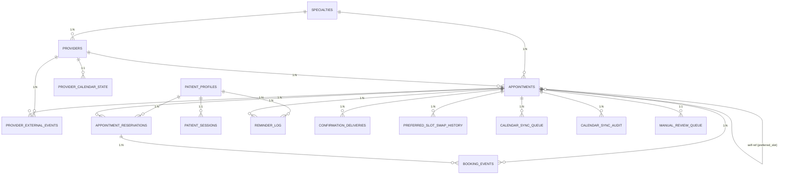

# Data Model - Production Schema Design

**Date:** 2026-06-22  
**Status:** Production  
**Version:** 1.0

## Executive Summary

This document defines the canonical entity model for the PropellQ Appointment Booking system, establishing normalized domain boundaries, explicit constraint strategies, and performance-optimized index patterns. The schema enforces data integrity through PK/FK/Check constraints and prevents duplicates through unique constraints and composite keys.

---

## 1. Domain Entities and Cardinality

### 1.1 Reference Data Domain

#### Specialties
**Purpose:** Define clinical specialties (e.g., Cardiology, Dermatology)

| Attribute | Type | Constraints | Notes |
|-----------|------|-------------|-------|
| id | INTEGER | PRIMARY KEY | Auto-incremented specialty identifier |
| name | TEXT | NOT NULL, UNIQUE | Specialty display name; uniqueness prevents duplicate specialties |
| is_active | INTEGER | NOT NULL, DEFAULT 1 | Soft-delete marker (1=active, 0=archived) |

**Cardinality:**
- 1 Specialty → Many Providers
- 1 Specialty → Many Appointments

---

#### Providers
**Purpose:** Store provider/clinician information and credentials

| Attribute | Type | Constraints | Notes |
|-----------|------|-------------|-------|
| id | INTEGER | PRIMARY KEY | Auto-incremented provider identifier |
| name | TEXT | NOT NULL | Provider full name |
| credentials | TEXT | NOT NULL | Certification/license string |
| specialty_id | INTEGER | NOT NULL, FK → specialties | Domain scoping |
| photo_url | TEXT | NULL | Provider profile image URL |
| review_count | INTEGER | NOT NULL, DEFAULT 0 | Cumulative review count |
| bio | TEXT | NULL | Professional biography |
| is_active | INTEGER | NOT NULL, DEFAULT 1 | Soft-delete marker |

**Cardinality:**
- 1 Provider → Many Appointments
- 1 Provider → 1 Provider Calendar State
- 1 Provider → Many Provider External Events

---

### 1.2 Booking Core Domain

#### Patient Profiles
**Purpose:** Master patient identity and preferences

| Attribute | Type | Constraints | Notes |
|-----------|------|-------------|-------|
| id | INTEGER | PRIMARY KEY | Auto-incremented patient identifier |
| first_name | TEXT | NOT NULL | Patient given name |
| last_name | TEXT | NOT NULL | Patient family name |
| email | TEXT | NOT NULL, UNIQUE | Patient contact email; uniqueness ensures 1:1 email binding |
| phone | TEXT | NOT NULL, UNIQUE | Patient phone number; uniqueness ensures 1:1 phone binding |
| preferred_timezone | TEXT | NOT NULL, DEFAULT 'America/Chicago' | Patient local timezone |
| reminder_channels | TEXT | NOT NULL, DEFAULT '["sms","email"]' | JSON array of notification channels |
| do_not_disturb | INTEGER | NOT NULL, DEFAULT 0 | Contact suppression flag (1=suppressed, 0=active) |
| created_at | TEXT | NOT NULL, DEFAULT CURRENT_TIMESTAMP | Profile creation timestamp |

**Cardinality:**
- 1 Patient Profile → Many Appointment Reservations
- 1 Patient Profile → 1 Patient Session
- 1 Patient Profile → Many Reminder Logs

**Uniqueness Boundary:** Email and phone must be unique; prevents duplicate patient profiles for same contact.

---

#### Appointments
**Purpose:** Appointment slot availability, booking state, and provider integration

| Attribute | Type | Constraints | Notes |
|-----------|------|-------------|-------|
| id | INTEGER | PRIMARY KEY | Auto-incremented appointment identifier |
| provider_id | INTEGER | NOT NULL, FK → providers | Appointment provider assignment |
| specialty_id | INTEGER | NOT NULL, FK → specialties | Denormalized for query efficiency |
| appointment_date | TEXT | NOT NULL | Date in ISO 8601 format (YYYY-MM-DD) |
| start_time | TEXT | NOT NULL | Start time in ISO 8601 format (HH:MM:SS) |
| end_time | TEXT | NOT NULL | End time in ISO 8601 format (HH:MM:SS) |
| location | TEXT | NOT NULL | Physical or virtual meeting location |
| status | TEXT | NOT NULL, CHECK | One of: 'available', 'booked', 'cancelled' |
| duration_minutes | INTEGER | NOT NULL, DEFAULT 30 | Slot duration in minutes |
| appointment_timezone | TEXT | NOT NULL, DEFAULT 'America/Chicago' | Provider local timezone |
| preferred_slot_id | INTEGER | NULL, FK → appointments (id) | Self-referential for slot swapping |
| preferred_window_expires_at | TEXT | NULL | Preferred slot reservation expiration |
| reservation_expires_at | TEXT | NULL | Current reservation expiration (for timeout logic) |
| reservation_token | TEXT | NULL | Idempotency token for reservation claims |
| patient_first_name | TEXT | NULL | Denormalized patient name for confirmation emails |
| patient_last_name | TEXT | NULL | Denormalized patient name for confirmation emails |
| patient_email | TEXT | NULL | Denormalized patient email |
| patient_phone | TEXT | NULL | Denormalized patient phone |
| patient_timezone | TEXT | NULL | Denormalized patient timezone |
| patient_notes | TEXT | NULL | Patient-provided booking notes |
| checkout_status | TEXT | NOT NULL, DEFAULT 'searching', CHECK | Booking workflow phase: 'searching', 'reserved', 'confirmed', 'expired', 'cancelled' |
| confirmation_sent_at | TEXT | NULL | Booking confirmation email send timestamp |
| reminder_sent_48h_at | TEXT | NULL | 48-hour reminder send timestamp |
| reminder_sent_24h_at | TEXT | NULL | 24-hour reminder send timestamp |
| reminder_sent_2h_at | TEXT | NULL | 2-hour reminder send timestamp |
| google_event_id | TEXT | NULL | External Google Calendar event ID |
| outlook_event_id | TEXT | NULL | External Outlook Calendar event ID |
| last_synced_at | TEXT | NULL | Last successful calendar sync timestamp |
| sync_status | TEXT | NOT NULL, DEFAULT 'not_connected', CHECK | Calendar sync state |
| version | INTEGER | NOT NULL, DEFAULT 0 | Optimistic lock version |
| created_at | TEXT | NOT NULL, DEFAULT CURRENT_TIMESTAMP | Slot creation timestamp |

**Cardinality:**
- 1 Appointment → 1 Provider (many-to-1)
- 1 Appointment → Many Appointment Reservations
- 1 Appointment → Many Booking Events
- 1 Appointment → Many Confirmation Deliveries
- 1 Appointment → Many Reminder Logs
- 1 Appointment → Many Preferred Slot Swap History
- 1 Appointment → Many Calendar Sync Queue
- 1 Appointment → Many Calendar Sync Audit
- 1 Appointment → 1 Manual Review Queue
- 1 Appointment → Many Provider External Events

**Critical Queries:**
- Lookup available appointments by specialty, date, and provider
- Fetch appointment by reservation token
- Query appointments in checkout state
- Query appointments by sync status
- Lookup preferred slot swaps

---

#### Appointment Reservations
**Purpose:** Capture reservation state, idempotency, and patient binding

| Attribute | Type | Constraints | Notes |
|-----------|------|-------------|-------|
| id | INTEGER | PRIMARY KEY | Auto-incremented reservation identifier |
| appointment_id | INTEGER | NOT NULL, FK → appointments | Booked appointment reference |
| patient_profile_id | INTEGER | NOT NULL, FK → patient_profiles | Patient identity |
| reservation_token | TEXT | NOT NULL, UNIQUE | Idempotency key; prevents duplicate reservations |
| idempotency_key | TEXT | NULL | Client-provided idempotency key for API requests |
| status | TEXT | NOT NULL, DEFAULT 'active', CHECK | Reservation lifecycle state |
| expires_at | TEXT | NOT NULL | Reservation expiration timestamp (typically 15 minutes) |
| preferred_slot_id | INTEGER | NULL, FK → appointments | Slot swap target if patient requests change |
| created_at | TEXT | NOT NULL, DEFAULT CURRENT_TIMESTAMP | Reservation creation timestamp |
| confirmed_at | TEXT | NULL | Booking confirmation timestamp (when checkout completes) |

**Cardinality:**
- 1 Appointment Reservation → 1 Appointment
- 1 Appointment Reservation → 1 Patient Profile
- 1 Appointment Reservation → Many Booking Events

**Uniqueness Boundary:** Reservation token ensures idempotent reservation claims and prevents double-booking.

---

### 1.3 Communication Domain

#### Booking Events
**Purpose:** Event log for all booking state transitions and diagnostics

| Attribute | Type | Constraints | Notes |
|-----------|------|-------------|-------|
| id | INTEGER | PRIMARY KEY | Auto-incremented event identifier |
| reservation_id | INTEGER | NULL, FK → appointment_reservations | Reservation this event relates to |
| appointment_id | INTEGER | NOT NULL, FK → appointments | Appointment this event relates to |
| event_type | TEXT | NOT NULL | Event type (e.g., 'reserved', 'confirmed', 'cancelled') |
| correlation_id | TEXT | NOT NULL | Distributed trace correlation ID |
| payload_json | TEXT | NULL | Event payload as JSON |
| created_at | TEXT | NOT NULL, DEFAULT CURRENT_TIMESTAMP | Event creation timestamp |

**Cardinality:**
- 1 Booking Event → 1 Appointment
- 1 Booking Event → 0..1 Appointment Reservation (nullable for historical events)

---

#### Confirmation Deliveries
**Purpose:** Email delivery tracking for booking confirmations

| Attribute | Type | Constraints | Notes |
|-----------|------|-------------|-------|
| id | INTEGER | PRIMARY KEY | Auto-incremented delivery record |
| appointment_id | INTEGER | NOT NULL, FK → appointments | Appointment confirmation pertains to |
| recipient_email | TEXT | NOT NULL | Recipient email address |
| status | TEXT | NOT NULL, CHECK | Delivery state: 'queued', 'sent', 'failed' |
| retry_count | INTEGER | NOT NULL, DEFAULT 0 | Number of delivery attempts |
| template_version | TEXT | NOT NULL, DEFAULT 'v1' | Email template version |
| attachment_path | TEXT | NULL | Path to confirmation PDF or document |
| external_message_id | TEXT | NULL | Email service provider message ID |
| failure_reason | TEXT | NULL | Error message if delivery failed |
| queued_at | TEXT | NOT NULL, DEFAULT CURRENT_TIMESTAMP | Queued timestamp |
| sent_at | TEXT | NULL | Actual send timestamp |

**Cardinality:**
- 1 Confirmation Delivery → 1 Appointment

---

#### Reminder Log
**Purpose:** Track reminder notifications sent to patients

| Attribute | Type | Constraints | Notes |
|-----------|------|-------------|-------|
| id | INTEGER | PRIMARY KEY | Auto-incremented reminder record |
| appointment_id | INTEGER | NOT NULL, FK → appointments | Appointment this reminder pertains to |
| patient_profile_id | INTEGER | NOT NULL, FK → patient_profiles | Recipient patient |
| reminder_type | TEXT | NOT NULL, CHECK | Reminder timing: '48h', '24h', '2h', 'swap' |
| channel | TEXT | NOT NULL, CHECK | Delivery channel: 'sms', 'email' |
| delivery_status | TEXT | NOT NULL, CHECK | Delivery outcome: 'queued', 'sent', 'failed', 'skipped' |
| retry_count | INTEGER | NOT NULL, DEFAULT 0 | Number of delivery attempts |
| sent_at | TEXT | NULL | Actual send timestamp |
| external_message_id | TEXT | NULL | Message service provider ID |
| failure_reason | TEXT | NULL | Error message if delivery failed |
| correlation_id | TEXT | NOT NULL | Distributed trace correlation ID |
| created_at | TEXT | NOT NULL, DEFAULT CURRENT_TIMESTAMP | Record creation timestamp |

**Cardinality:**
- 1 Reminder Log → 1 Appointment
- 1 Reminder Log → 1 Patient Profile

---

### 1.4 Slot Optimization Domain

#### Preferred Slot Swap History
**Purpose:** Track patient-initiated slot changes and swap outcomes

| Attribute | Type | Constraints | Notes |
|-----------|------|-------------|-------|
| id | INTEGER | PRIMARY KEY | Auto-incremented swap record |
| appointment_id | INTEGER | NOT NULL, FK → appointments | Original booked appointment |
| original_slot_id | INTEGER | NOT NULL, FK → appointments | Original slot before swap |
| new_slot_id | INTEGER | NULL, FK → appointments | New slot after swap (nullable if swap failed) |
| status | TEXT | NOT NULL, CHECK | Outcome state: 'completed', 'skipped', 'failed' |
| reason_code | TEXT | NOT NULL | Swap reason (e.g., 'patient_requested', 'unavailable_reschedule') |
| correlation_id | TEXT | NOT NULL | Distributed trace correlation ID |
| created_at | TEXT | NOT NULL, DEFAULT CURRENT_TIMESTAMP | Swap transaction timestamp |

**Cardinality:**
- 1 Preferred Slot Swap History → 1 Appointment (original)
- 1 Preferred Slot Swap History → 0..1 Appointment (new slot, nullable)

---

### 1.5 Calendar Integration Domain

#### Patient Sessions
**Purpose:** OAuth credentials and calendar integration state per patient

| Attribute | Type | Constraints | Notes |
|-----------|------|-------------|-------|
| id | INTEGER | PRIMARY KEY | Auto-incremented session record |
| patient_profile_id | INTEGER | NOT NULL, FK → patient_profiles | Patient owning session |
| google_refresh_token | TEXT | NULL | Encrypted Google OAuth refresh token |
| google_access_token_expires_at | TEXT | NULL | Google token expiration timestamp |
| google_calendar_id | TEXT | NULL | Patient's Google Calendar ID |
| google_auth_status | TEXT | NOT NULL, DEFAULT 'revoked', CHECK | Google integration state |
| outlook_refresh_token | TEXT | NULL | Encrypted Outlook OAuth refresh token |
| outlook_access_token_expires_at | TEXT | NULL | Outlook token expiration timestamp |
| outlook_calendar_id | TEXT | NULL | Patient's Outlook Calendar ID |
| outlook_auth_status | TEXT | NOT NULL, DEFAULT 'revoked', CHECK | Outlook integration state |
| oauth_state_nonce | TEXT | NULL | OAuth state parameter for security |
| created_at | TEXT | NOT NULL, DEFAULT CURRENT_TIMESTAMP | Session creation timestamp |
| updated_at | TEXT | NOT NULL, DEFAULT CURRENT_TIMESTAMP | Last update timestamp |

**Cardinality:**
- 1 Patient Session → 1 Patient Profile

---

#### Calendar Sync Queue
**Purpose:** Queue for asynchronous calendar sync operations

| Attribute | Type | Constraints | Notes |
|-----------|------|-------------|-------|
| id | INTEGER | PRIMARY KEY | Auto-incremented queue entry |
| appointment_id | INTEGER | NOT NULL, FK → appointments | Appointment to sync |
| action | TEXT | NOT NULL, CHECK | Operation type: 'create', 'update', 'delete', 'pull_reconcile' |
| calendar_type | TEXT | NOT NULL, CHECK | Calendar service: 'google', 'outlook' |
| idempotency_key | TEXT | NOT NULL | Deduplication key; prevents duplicate sync jobs |
| retry_count | INTEGER | NOT NULL, DEFAULT 0 | Number of sync attempts |
| scheduled_retry_at | TEXT | NOT NULL, DEFAULT CURRENT_TIMESTAMP | Next retry timestamp |
| status | TEXT | NOT NULL, DEFAULT 'pending', CHECK | Processing state: 'pending', 'processing', 'synced', 'failed', 'manual_review' |
| last_error | TEXT | NULL | Error message from last sync attempt |
| payload_json | TEXT | NULL | Sync operation payload as JSON |
| created_at | TEXT | NOT NULL, DEFAULT CURRENT_TIMESTAMP | Queue entry creation |
| updated_at | TEXT | NOT NULL, DEFAULT CURRENT_TIMESTAMP | Last status update |

**Cardinality:**
- 1 Calendar Sync Queue → 1 Appointment

**Uniqueness Boundary:** Composite unique key (appointment_id, action, calendar_type, idempotency_key) prevents duplicate sync jobs.

---

#### Calendar Sync Audit
**Purpose:** Immutable audit trail of calendar sync operations

| Attribute | Type | Constraints | Notes |
|-----------|------|-------------|-------|
| id | INTEGER | PRIMARY KEY | Auto-incremented audit record |
| appointment_id | INTEGER | NOT NULL, FK → appointments | Appointment sync pertains to |
| calendar_type | TEXT | NOT NULL, CHECK | Calendar service: 'google', 'outlook' |
| external_event_id | TEXT | NULL | External calendar event ID from service |
| action | TEXT | NOT NULL | Operation performed: 'create', 'update', 'delete', 'pull_reconcile' |
| result | TEXT | NOT NULL | Outcome: 'success', 'failure', 'conflict', 'skipped' |
| details_json | TEXT | NULL | Operation details as JSON |
| created_at | TEXT | NOT NULL, DEFAULT CURRENT_TIMESTAMP | Audit timestamp |

**Cardinality:**
- 1 Calendar Sync Audit → 1 Appointment

---

#### Manual Review Queue
**Purpose:** Escalation queue for sync conflicts and exceptional conditions

| Attribute | Type | Constraints | Notes |
|-----------|------|-------------|-------|
| id | INTEGER | PRIMARY KEY | Auto-incremented review record |
| appointment_id | INTEGER | NOT NULL, FK → appointments | Appointment requiring review |
| review_type | TEXT | NOT NULL, CHECK | Escalation reason: 'calendar_conflict', 'external_reschedule', 'sync_failure' |
| status | TEXT | NOT NULL, DEFAULT 'open', CHECK | Review state: 'open', 'resolved' |
| details_json | TEXT | NULL | Context and diagnostic information |
| created_at | TEXT | NOT NULL, DEFAULT CURRENT_TIMESTAMP | Escalation timestamp |

**Cardinality:**
- 1 Manual Review Queue → 1 Appointment

---

#### Provider Calendar State
**Purpose:** Provider calendar integration state and sync metadata

| Attribute | Type | Constraints | Notes |
|-----------|------|-------------|-------|
| id | INTEGER | PRIMARY KEY | Auto-incremented state record |
| provider_id | INTEGER | NOT NULL, FK → providers | Provider owning this calendar state |
| calendar_type | TEXT | NOT NULL, CHECK | Calendar service: 'google', 'outlook' |
| last_sync_watermark | TEXT | NULL | Last sync cursor/watermark for incremental pulls |
| webhook_enabled | INTEGER | NOT NULL, DEFAULT 0 | Webhook enablement flag (1=enabled, 0=disabled) |
| webhook_secret | TEXT | NULL | Webhook secret for signature validation |
| updated_at | TEXT | NOT NULL, DEFAULT CURRENT_TIMESTAMP | Last sync metadata update |

**Cardinality:**
- 1 Provider Calendar State → 1 Provider

---

#### Provider External Events
**Purpose:** Snapshot of external calendar events blocking appointment slots

| Attribute | Type | Constraints | Notes |
|-----------|------|-------------|-------|
| id | INTEGER | PRIMARY KEY | Auto-incremented event record |
| appointment_id | INTEGER | NOT NULL, FK → appointments | Appointment slot this event blocks |
| provider_id | INTEGER | NOT NULL, FK → providers | Provider owning the event |
| calendar_type | TEXT | NOT NULL, CHECK | Calendar service: 'google', 'outlook' |
| external_event_id | TEXT | NOT NULL | External calendar event ID |
| starts_at | TEXT | NOT NULL | Event start timestamp (ISO 8601) |
| ends_at | TEXT | NOT NULL | Event end timestamp (ISO 8601) |
| status | TEXT | NOT NULL, DEFAULT 'active', CHECK | Event state: 'active', 'deleted', 'rescheduled' |
| updated_at | TEXT | NOT NULL, DEFAULT CURRENT_TIMESTAMP | Last update timestamp |

**Cardinality:**
- 1 Provider External Event → 1 Appointment
- 1 Provider External Event → 1 Provider

---

## 2. Entity Relationship Diagram

---

## 3. Domain Aggregate Boundaries

### Booking Aggregate
- **Root:** `Appointment`
- **Members:** Appointment, Appointment Reservations, Booking Events
- **Invariants:**
  - Exactly one reservation may be active per appointment at a time
  - Cancellation cascades to all related reservations
  - Confirmed appointment cannot transition to 'available' without manual intervention

### Patient Aggregate
- **Root:** `Patient Profile`
- **Members:** Patient Profile, Patient Sessions
- **Invariants:**
  - Email and phone uniqueness prevents duplicate identities
  - Patient sessions expire after 30 days of inactivity
  - Do-not-disturb suppresses all non-critical reminders

### Calendar Integration Aggregate
- **Root:** `Appointment` (from a provider perspective)
- **Members:** Calendar Sync Queue, Calendar Sync Audit, Manual Review Queue, Provider External Events
- **Invariants:**
  - Each sync action is idempotent (deduplicated by composite key)
  - Sync conflicts escalate to manual review
  - External events block corresponding appointment slots

---

## 4. Normalization and Design Decisions

### Denormalization Trade-offs

| Field | Normalized Source | Reason for Denormalization |
|-------|-------------------|---------------------------|
| appointments.specialty_id | providers → specialties | Enables indexed queries by specialty without multi-table joins |
| appointments.patient_* | patient_profiles | Captures patient state at booking time; prevents identity changes from affecting confirmations |
| appointment_reservations.preferred_slot_id | appointments | Enables efficient swap candidate lookups |

### Soft-Delete Pattern

- `specialties.is_active` and `providers.is_active` support logical deletion without cascading orphan risks
- `provider_external_events.status` tracks lifecycle state (active, deleted, rescheduled)
- Benefits: Preserves historical referential integrity, simplifies audit trails

### Self-Referential Relationships

- `appointments.preferred_slot_id → appointments.id` enables slot swapping and preferred window tracking
- `preferred_slot_swap_history.new_slot_id → appointments.id` allows optional null for failed swaps

---

## 5. Constraint Strategy Summary

| Constraint Type | Count | Examples |
|-----------------|-------|----------|
| Primary Keys | 16 | All tables have INTEGER PRIMARY KEY |
| Foreign Keys | 30+ | Provider → Specialty, Appointment → Provider, etc. |
| Check Constraints | 18 | Status enumerations, timezone validation |
| Unique Constraints | 6 | Email, phone, reservation_token, calendar_sync_queue composite |
| Not Null | 50+ | Core attributes enforced as NOT NULL |

---

## 6. Version History

| Version | Date | Author | Changes |
|---------|------|--------|---------|
| 1.0 | 2026-06-22 | AI Assistant | Initial production entity model; normalized boundaries; constraint and cardinality documentation |

