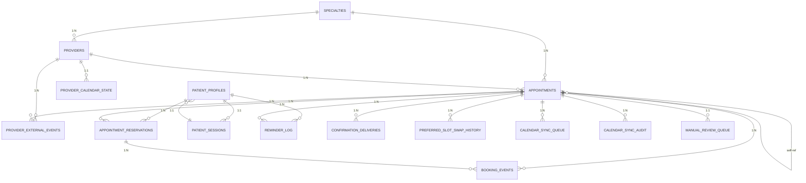

# Data Model Glossary and Entity Relationships

**Date:** 2026-06-22  
**Version:** 1.0  
**Status:** Production Documentation  

---

## 1. Data Model Glossary

### Core Entities

#### Appointment
**Definition:** A scheduled time slot for a clinical appointment between a provider and a patient.

**Attributes:**
- `id` (PK): Unique appointment identifier
- `provider_id` (FK): Assigned provider
- `specialty_id` (FK): Clinical specialty (denormalized from provider for performance)
- `appointment_date` (TEXT): Date in ISO 8601 format (YYYY-MM-DD)
- `start_time`, `end_time` (TEXT): Time boundaries in ISO 8601 format
- `location` (TEXT): Physical or virtual meeting place
- `status` (TEXT): One of 'available', 'booked', 'cancelled'
- `checkout_status` (TEXT): Booking workflow phase (searching → reserved → confirmed)
- `sync_status` (TEXT): Calendar integration state (not_connected, pending, synced, failed, manual_review, revoked)
- `duration_minutes` (INTEGER): Slot length in minutes (typically 30)
- `patient_*` (TEXT): Denormalized patient info captured at booking time (first_name, last_name, email, phone, timezone)
- `reservation_token` (TEXT): Idempotency key for reservation claims
- `*_sent_at` (TEXT): Event timestamps (confirmation, reminders)
- `google_event_id`, `outlook_event_id` (TEXT): External calendar event references
- `version` (INTEGER): Optimistic lock version for concurrent updates

**Business Rules:**
- One appointment can transition from 'available' → 'booked' → 'cancelled' (one-way state machine)
- At most one active reservation per appointment (enforced by application logic)
- Patient fields are immutable once appointment is booked (snapshot semantics)
- Denormalized specialty_id enables efficient queries without joining providers table

**Relationships:**
- 1 Appointment → 1 Provider (FK: provider_id)
- 1 Appointment → 1 Specialty (FK: specialty_id)
- 1 Appointment → Many Appointment Reservations
- 1 Appointment → Many Reminder Logs
- Self-referential: appointment → appointment (preferred_slot_id for slot swaps)

---

#### Provider
**Definition:** A clinician or healthcare provider offering appointment slots.

**Attributes:**
- `id` (PK): Unique provider identifier
- `name` (TEXT): Provider's full name
- `credentials` (TEXT): Certification/license information
- `specialty_id` (FK): Primary clinical specialty
- `photo_url` (TEXT): Profile image URL (nullable)
- `review_count` (INTEGER): Cumulative patient review count
- `bio` (TEXT): Professional biography (nullable)
- `is_active` (INTEGER): Soft-delete marker (1=active, 0=archived)

**Business Rules:**
- Provider must be active (is_active=1) to be visible for booking
- Specialty is primary classification; cascade deletion restricted to prevent orphans
- Review count is denormalized; actual reviews stored elsewhere

**Relationships:**
- 1 Provider → Many Appointments
- 1 Provider → 1 Specialty (FK: specialty_id)
- 1 Provider → 1 Provider Calendar State
- 1 Provider → Many Provider External Events

---

#### Patient Profile
**Definition:** Master patient identity with contact and notification preferences.

**Attributes:**
- `id` (PK): Unique patient identifier
- `first_name`, `last_name` (TEXT): Patient name
- `email` (TEXT): Unique email address
- `phone` (TEXT): Unique phone number
- `preferred_timezone` (TEXT): Patient's local timezone (default: America/Chicago)
- `reminder_channels` (TEXT): JSON array of notification channels ['sms', 'email']
- `do_not_disturb` (INTEGER): Suppression flag for reminders (1=suppressed, 0=normal)

**Business Rules:**
- Email and phone are unique; prevent duplicate patient identities
- Patient can have multiple appointments and reservations
- do_not_disturb flag suppresses non-critical communications (e.g., reminders)

**Relationships:**
- 1 Patient Profile → Many Appointment Reservations
- 1 Patient Profile → 1 Patient Session
- 1 Patient Profile → Many Reminder Logs

---

#### Specialty
**Definition:** Clinical medical specialty (Cardiology, Dermatology, etc.).

**Attributes:**
- `id` (PK): Unique specialty identifier
- `name` (TEXT): Specialty display name (UNIQUE)
- `is_active` (INTEGER): Soft-delete marker (1=active, 0=archived)

**Business Rules:**
- Specialty names are globally unique
- Soft delete preserves referential integrity if provider's specialty is archived

**Relationships:**
- 1 Specialty → Many Providers
- 1 Specialty → Many Appointments

---

### Booking Domain

#### Appointment Reservation
**Definition:** A booking confirmation that locks an appointment to a patient for a limited time.

**Attributes:**
- `id` (PK): Unique reservation identifier
- `appointment_id` (FK): Reserved appointment
- `patient_profile_id` (FK): Patient claiming reservation
- `reservation_token` (TEXT): Unique idempotency key (prevents duplicate bookings)
- `idempotency_key` (TEXT): Client-provided idempotency key (optional)
- `status` (TEXT): One of 'active', 'expired', 'confirmed', 'cancelled'
- `expires_at` (TEXT): Reservation expiration time (typically 15 minutes)
- `preferred_slot_id` (FK, nullable): Alternative slot if patient requests swap
- `confirmed_at` (TEXT): Checkout completion timestamp (null until confirmed)

**Business Rules:**
- One active reservation per appointment at any time
- Reservation expires after timeout (expires_at) unless confirmed
- Idempotent claim: same reservation_token always returns same reservation
- Once confirmed, cannot be cancelled by patient (admin-only)

**Relationships:**
- 1 Appointment Reservation → 1 Appointment
- 1 Appointment Reservation → 1 Patient Profile
- 1 Appointment Reservation → Many Booking Events

---

#### Booking Event
**Definition:** Immutable event log entry capturing booking state transitions.

**Attributes:**
- `id` (PK): Event identifier
- `appointment_id` (FK): Appointment this event pertains to
- `reservation_id` (FK, nullable): Associated reservation (if applicable)
- `event_type` (TEXT): Event category (e.g., 'reserved', 'confirmed', 'cancelled')
- `correlation_id` (TEXT): Distributed trace ID for request tracking
- `payload_json` (TEXT): Event details as JSON

**Business Rules:**
- Events are immutable (append-only log)
- All state changes recorded for audit trail
- Correlation ID enables tracing across microservices

**Relationships:**
- 1 Booking Event → 1 Appointment
- 1 Booking Event → 0..1 Appointment Reservation

---

### Communication Domain

#### Confirmation Delivery
**Definition:** Tracks booking confirmation email delivery.

**Attributes:**
- `id` (PK): Delivery record identifier
- `appointment_id` (FK): Appointment being confirmed
- `recipient_email` (TEXT): Email recipient address
- `status` (TEXT): One of 'queued', 'sent', 'failed'
- `retry_count` (INTEGER): Number of delivery attempts
- `template_version` (TEXT): Email template version (for A/B testing)
- `attachment_path` (TEXT): Path to confirmation PDF/attachment (nullable)
- `external_message_id` (TEXT): Email service provider message ID
- `failure_reason` (TEXT): Error message if delivery failed

**Business Rules:**
- Retry logic: exponential backoff up to max retry limit
- Template versioning enables tracking which template drove conversions
- Status terminal states: 'sent' or 'failed' after max retries

**Relationships:**
- 1 Confirmation Delivery → 1 Appointment

---

#### Reminder Log
**Definition:** Records reminder notification delivery (SMS/Email).

**Attributes:**
- `id` (PK): Reminder record identifier
- `appointment_id` (FK): Appointment reminder pertains to
- `patient_profile_id` (FK): Recipient patient
- `reminder_type` (TEXT): One of '48h', '24h', '2h', 'swap'
- `channel` (TEXT): One of 'sms', 'email'
- `delivery_status` (TEXT): One of 'queued', 'sent', 'failed', 'skipped'
- `retry_count` (INTEGER): Delivery attempts
- `correlation_id` (TEXT): Distributed trace ID
- `sent_at` (TEXT): Actual send timestamp

**Business Rules:**
- Reminders sent at fixed intervals (48h, 24h, 2h before appointment)
- Skipped if patient has do_not_disturb flag set
- Channel selection respects patient's reminder_channels preference
- Swap reminders sent if patient changes appointment

**Relationships:**
- 1 Reminder Log → 1 Appointment
- 1 Reminder Log → 1 Patient Profile

---

#### Preferred Slot Swap History
**Definition:** Records patient-initiated appointment swaps.

**Attributes:**
- `id` (PK): Swap history record identifier
- `appointment_id` (FK): Original booked appointment
- `original_slot_id` (FK): Original slot before swap
- `new_slot_id` (FK, nullable): New slot after swap (null if swap failed)
- `status` (TEXT): One of 'completed', 'skipped', 'failed'
- `reason_code` (TEXT): Business reason (patient_requested, unavailable_reschedule)
- `correlation_id` (TEXT): Distributed trace ID

**Business Rules:**
- Enables customer success teams to track swap patterns
- Failed swaps recorded for debugging (new_slot_id = null)
- Audit trail for SLA compliance

**Relationships:**
- 1 Preferred Slot Swap History → 1 Appointment (original)
- 1 Preferred Slot Swap History → 0..1 Appointment (new slot, nullable)

---

### Calendar Integration Domain

#### Patient Session
**Definition:** OAuth session and calendar integration state for a patient.

**Attributes:**
- `id` (PK): Session identifier
- `patient_profile_id` (FK): Patient owning session (UNIQUE)
- `google_refresh_token` (TEXT): Encrypted Google OAuth token
- `google_access_token_expires_at` (TEXT): Token expiration
- `google_calendar_id` (TEXT): Patient's Google Calendar ID
- `google_auth_status` (TEXT): One of 'revoked', 'authorized', 'error'
- `outlook_refresh_token` (TEXT): Encrypted Outlook OAuth token
- `outlook_calendar_id` (TEXT): Patient's Outlook Calendar ID
- `outlook_auth_status` (TEXT): One of 'revoked', 'authorized', 'error'
- `oauth_state_nonce` (TEXT): OAuth state parameter for security

**Business Rules:**
- One session per patient (1:1 relationship)
- Tokens encrypted at rest (application responsibility)
- Auth status transitions: revoked → authorized → authorized (or error)
- Revoked: patient explicitly disconnected; no syncing

**Relationships:**
- 1 Patient Session → 1 Patient Profile

---

#### Calendar Sync Queue
**Definition:** Asynchronous queue for calendar integration sync operations.

**Attributes:**
- `id` (PK): Queue entry identifier
- `appointment_id` (FK): Appointment to sync
- `action` (TEXT): One of 'create', 'update', 'delete', 'pull_reconcile'
- `calendar_type` (TEXT): One of 'google', 'outlook'
- `idempotency_key` (TEXT): Deduplication key
- `status` (TEXT): One of 'pending', 'processing', 'synced', 'failed', 'manual_review'
- `retry_count` (INTEGER): Sync attempts
- `scheduled_retry_at` (TEXT): Next retry time
- `last_error` (TEXT): Error message from last attempt

**Business Rules:**
- Composite unique constraint: (appointment_id, action, calendar_type, idempotency_key) prevents duplicate sync jobs
- Worker pool processes pending jobs ordered by created_at
- Failed jobs escalated to manual review if retry_count exceeded
- Pull_reconcile action reconciles external calendar with booking system state

**Relationships:**
- 1 Calendar Sync Queue → 1 Appointment

---

#### Calendar Sync Audit
**Definition:** Immutable audit trail of all calendar sync operations.

**Attributes:**
- `id` (PK): Audit record identifier
- `appointment_id` (FK): Appointment sync pertains to
- `calendar_type` (TEXT): One of 'google', 'outlook'
- `external_event_id` (TEXT): External calendar event ID (nullable if creation failed)
- `action` (TEXT): Operation performed (create, update, delete, pull_reconcile)
- `result` (TEXT): Outcome (success, failure, conflict, skipped)
- `details_json` (TEXT): Operation details and error info as JSON

**Business Rules:**
- Append-only; immutable for compliance
- Enables post-incident forensics
- Tracks both successful and failed operations

**Relationships:**
- 1 Calendar Sync Audit → 1 Appointment

---

#### Manual Review Queue
**Definition:** Escalation queue for sync conflicts requiring human intervention.

**Attributes:**
- `id` (PK): Review record identifier
- `appointment_id` (FK): Appointment requiring review
- `review_type` (TEXT): One of 'calendar_conflict', 'external_reschedule', 'sync_failure'
- `status` (TEXT): One of 'open', 'resolved'
- `details_json` (TEXT): Context for human reviewer

**Business Rules:**
- Escalated from sync_queue when retry threshold exceeded
- Support team manually resolves and closes

**Relationships:**
- 1 Manual Review Queue → 1 Appointment

---

#### Provider Calendar State
**Definition:** Tracks provider calendar integration metadata and sync state.

**Attributes:**
- `id` (PK): State record identifier
- `provider_id` (FK): Provider owning calendar state
- `calendar_type` (TEXT): One of 'google', 'outlook'
- `last_sync_watermark` (TEXT): Cursor for incremental sync
- `webhook_enabled` (INTEGER): Webhook active flag (1/0)
- `webhook_secret` (TEXT): Webhook signature validation secret

**Business Rules:**
- Composite unique constraint: (provider_id, calendar_type) ensures single state per provider/calendar pair
- Watermark enables efficient incremental pulls (only events since watermark)
- Webhook reduces polling overhead

**Relationships:**
- 1 Provider Calendar State → 1 Provider

---

#### Provider External Events
**Definition:** Snapshot of external calendar events (e.g., personal meetings) blocking appointment slots.

**Attributes:**
- `id` (PK): Event record identifier
- `appointment_id` (FK): Appointment slot this event blocks
- `provider_id` (FK): Provider owning event
- `calendar_type` (TEXT): One of 'google', 'outlook'
- `external_event_id` (TEXT): External calendar system event ID
- `starts_at`, `ends_at` (TEXT): Event time boundaries
- `status` (TEXT): One of 'active', 'deleted', 'rescheduled'

**Business Rules:**
- Composite unique constraint: (calendar_type, external_event_id, provider_id)
- Tracks event lifecycle (active → deleted/rescheduled)
- Used to determine appointment slot availability

**Relationships:**
- 1 Provider External Event → 1 Appointment
- 1 Provider External Event → 1 Provider

---

## 2. Entity Relationship Diagram (ERD)

**Legend:**
- `||--o{` = 1 to many (one-to-many)
- `||--||` = 1 to 1 (one-to-one)
- `o{--o{` = many to many (many-to-many)
- `--` = optional relationship (nullable FK)

---

## 3. Domain Aggregate Boundaries

### Booking Aggregate
**Root Entity:** Appointment  
**Members:** Appointment, Appointment Reservations, Booking Events

**Responsibilities:**
- Maintain appointment slot state (available/booked/cancelled)
- Manage reservation lifecycle (create, confirm, expire, cancel)
- Record all state transitions via Booking Events

**Invariants:**
- Exactly one active reservation per appointment (enforced by application)
- Cancelled appointments cannot transition to other states
- Patient data captured at reservation time; immutable thereafter

---

### Patient Aggregate
**Root Entity:** Patient Profile  
**Members:** Patient Profile, Patient Session

**Responsibilities:**
- Maintain patient identity and contact info
- Manage OAuth session state (Google/Outlook calendar integrations)
- Enforce reminder preferences (channels, do_not_disturb)

**Invariants:**
- Email and phone globally unique (natural keys)
- Sessions expire after inactivity (application-enforced)

---

### Calendar Integration Aggregate
**Root Entity:** Appointment (from provider perspective)  
**Members:** Calendar Sync Queue, Calendar Sync Audit, Manual Review Queue, Provider Calendar State, Provider External Events

**Responsibilities:**
- Sync appointments to external calendars (Google, Outlook)
- Detect external events that conflict with appointment slots
- Escalate conflicts to manual review
- Maintain sync audit trail for compliance

**Invariants:**
- Sync operations idempotent (deduplication via composite unique key)
- Conflicts trigger manual review (no auto-resolution)
- External events block corresponding appointment slots

---

## 4. Denormalization Justification

| Denormalized Column | Source Table | Performance Benefit | Trade-off |
|---|---|---|---|
| `appointments.specialty_id` | providers (specialty_id) | Avoids join to providers table; enables direct index on (specialty_id, date) | Updates specialty_id if provider's specialty changes (rare; admin action) |
| `appointments.patient_*` | patient_profiles | Captures state at booking; enables confirmation emails even if patient profile deleted | Patient info becomes stale if patient profile changes; intentional (bookings preserve snapshot) |

---

## 5. Cardinality Summary

| Relationship | Cardinality | Enforcement |
|---|---|---|
| Specialty → Providers | 1 : N | FK; ON DELETE RESTRICT |
| Specialty → Appointments | 1 : N | FK; ON DELETE RESTRICT (denormalized from Provider) |
| Provider → Appointments | 1 : N | FK; ON DELETE RESTRICT |
| Provider → Calendar State | 1 : 1 | FK; UNIQUE constraint |
| Appointment → Reservations | 1 : N | FK; Application enforces ≤ 1 active |
| Appointment → Events | 1 : N | FK; ON DELETE CASCADE (log entries) |
| Patient Profile → Reservations | 1 : N | FK; ON DELETE CASCADE |
| Patient Profile → Session | 1 : 1 | FK; UNIQUE constraint |

---

## 6. Version History

| Version | Date | Changes |
|---|---|---|
| 1.0 | 2026-06-22 | Initial glossary and ERD; all entities documented with attributes, business rules, and relationships |

